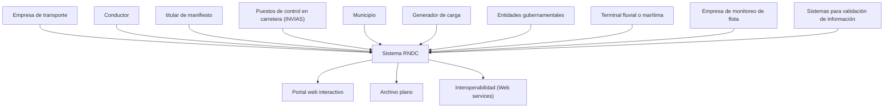

# RESOLUCIÓN NÚMERO 20263040016075

de 29-04-2026

"Por medio de la cual se unifica, compila, armoniza y actualiza la normatividad aplicable al Registro Nacional de Despachos de Carga – RNDC y se dictan otras disposiciones."

# LA MINISTRA DE TRANSPORTE

En ejercicio de sus facultades legales y reglamentarias, en especial las conferidas por el artículo 59 de la Ley 489 de 1998, el artículo 2 de la Ley 105 de 1993, el artículo 4 de la Ley 336 de 1996, y los numerales 6.2, 6.3, 6.5, y 6.10 del artículo 6 del Decreto 087 de 2011, y

# CONSIDERANDO

Que el artículo 365 de la Constitución Política de Colombia establece que "Los servicios públicos son inherentes a la finalidad social del Estado. Es deber del Estado asegurar su prestación eficiente a todos los habitantes del territorio nacional".

Que el artículo 2 de la Ley 105 de 1993 "Por la cual se dictan disposiciones básicas sobre el transporte, se redistribuyen competencias y recursos entre la Nación y las Entidades Territoriales, se reglamenta la planeación en el sector transporte y se dictan otras disposiciones", establece que el transporte es un servicio público sujeto a la regulación, control y vigilancia del Estado, orientado a garantizar su prestación en condiciones de calidad, oportunidad, seguridad y eficiencia.

Que el artículo 3 de la precitada Ley, determina que "el transporte público es una industria encaminada a garantizar la movilización de personas o cosas por medio de vehículos apropiados a cada una de las infraestructuras del sector, en condiciones de libertad de acceso, calidad y seguridad de los usuarios, sujeto a una contraprestación económica" y que, conforme al principio del acceso al transporte, el cual implica "(...) que el usuario pueda transportarse a través del medio y modo que escoja en buenas condiciones de acceso, comodidad, calidad, oportunidad y seguridad (...)".

Que el artículo 4 de la Ley 336 de 1996 "Por la cual se adopta el estatuto nacional del transporte", dispone que el transporte gozará de especial protección estatal y estará sometido a las condiciones y beneficios establecidos por las disposiciones reguladoras de la materia, las cuales se incluirán en el Plan Nacional de Desarrollo, y que, como servicio público, continuará bajo la dirección, regulación y control del Estado, sin perjuicio de que su prestación pueda ser encomendada a los particulares.

Que el artículo 5 de la citada Ley, otorga al transporte la calidad de servicio público esencial, lo cual implica que se encuentra sometido a la regulación del Estado para garantizar la prestación del servicio y la protección de los usuarios, conforme a los derechos y obligaciones que señale la reglamentación correspondiente para cada modo.

Que el artículo 2.2.1.7.3. del Decreto 1079 de 2015, modificado por el artículo 1 del Decreto 1017 de 2025 "Por el cual se modifica, adiciona y derogan unos artículos del Capítulo 7 del Título 1 de la Parte 2 del Libro 2 del Decreto 1079 de 2015, Único Reglamentario del Sector Transporte", establece que, para efectos del servicio de transporte de que trata el Decreto 2044 de 1988 o la norma que lo modifique, adicione o sustituya, el Registro de Contratación Directa que se realiza en el sistema de Registro Nacional de Despachos de Carga- RNDC, se constituye

# RESOLUCIÓN NÚMERO 20263040016075

de 29-04-2026

"Por medio de la cual se unifica, compila, armoniza y actualiza la normatividad aplicable al Registro Nacional de Despachos de Carga – RNDC y se dictan otras disposiciones."

como documento de transporte, y que el Ministerio de transporte reglamentará el registro de las operaciones de transporte de los productos señalados en el Decreto 2044 de 1988 dentro de los seis (6) meses siguientes a la entrada en vigencia del presente Decreto.

Que el artículo 2.2.1.7.4. del Decreto 1079 de 2015, modificado por el artículo 2 del Decreto 1017 de 2025, establece las definiciones aplicables al Capítulo 7 del Título 1 de la Parte 2 del Libro 2 del citado decreto, dentro de las cuales se encuentran, entre otras, las siguientes: horas de espera para el cargue, horas totales de cargue, horas de espera para el descargue, horas de descargue, horas totales de descargue, horas logísticas, valor a pagar, vehículo de carga, vehículo de carga liviana, Registro Nacional de Despachos de Carga (RNDC).

Que el artículo 2.2.1.7.4.1. del Decreto 1079 de 2015, modificado por el artículo 5 del Decreto 1017 de 2025, establece que las operaciones de las empresas de transporte público terrestre automotor de carga serán de carácter nacional, incluidos los trayectos que se realicen dentro del perímetro municipal.

Que el artículo 2.2.1.7.6.2 del Decreto 1079 de 2015, modificado por el artículo 12 del Decreto 1017 de 2025, establece que el generador de carga y la empresa de transporte tendrán la obligación de informar al Ministerio de Transporte, a través del Registro Nacional de Despachos de Carga - RNDC, el valor a pagar y el flete, así como las demás condiciones pactadas entre el propietario, poseedor o tenedor de un vehículo de servicio público de carga, de conformidad con la metodología y los requerimientos que para tal efecto establezca el Ministerio de Transporte.

Que el artículo 2.2.1.7.6.3 del Decreto 1079 de 2015, modificado por el artículo 13 del Decreto 1017 de 2025, señala que el Ministerio de Transporte deberá reglamentar la metodología para la captura de información a través del Registro Nacional de Despachos de Carga (RNDC), el esquema y procedimiento de monitoreo de los fletes y del valor a pagar, así como la manera de obtener los criterios técnicos, logísticos y de eficiencia a incorporar.

Que el artículo 2.2.1.7.6.5 del referido Decreto, señala que el Generador de Carga, la empresa de transporte, los propietarios, poseedores o tenedores de un vehículo deberán remitir al Ministerio de Transporte, cuando este lo requiera, la información referente a las relaciones económicas derivadas de la prestación del servicio público de transporte terrestre automotor de carga, en los términos y condiciones que este establezca.

Que el artículo 1 de la Resolución 377 de 2013 "Por la cual se adopta e implementa el Registro Nacional de Despachos de Carga (RNDC)" adoptó e implementó el Registro Nacional de Despachos de Carga (RNDC), para el registro de las operaciones de despachos de carga, el acceso al registro, el procedimiento para su elaboración y los mecanismos de control aplicables al transporte público terrestre automotor de carga.

Que la Resolución 20223040045515 de 2022 "Por la cual se actualiza el sistema del Registro Nacional de Despachos de Carga - RNDC y se dictan otras disposiciones", adoptó disposiciones para la implementación, operación y actualización del Registro Nacional de Despachos de Carga (RNDC), en desarrollo de lo previsto en el Decreto 1079 de 2015, con el propósito de garantizar la trazabilidad, transparencia y control de las operaciones del transporte público terrestre automotor de carga en el territorio nacional.

# RESOLUCIÓN NÚMERO 20263040016075

de 29-04-2026

"Por medio de la cual se unifica, compila, armoniza y actualiza la normatividad aplicable al Registro Nacional de Despachos de Carga – RNDC y se dictan otras disposiciones."

Que la Resolución 20223040077365 de 2022 "Por la cual se modifica el parágrafo del artículo 19 de la Resolución 20223040045515 de 2022: "por la cual se actualiza el sistema del Registro Nacional de Despachos de Carga (RNDC) y se dictan otras disposiciones", modificó el parágrafo del artículo 19 de la Resolución 20223040045515 de 2022, relacionado con el plazo para la verificación del Registro de Viaje Urbano.

Que la Resolución 20233040035795 de 2023 "Por la cual se prorroga el plazo establecido en el inciso 1 del artículo 19 de la Resolución 20223040045515 de 2022, para el registro de Facturación Electrónica en el sistema del Registro Nacional de Despachos de Carga -RNDC" prorrogó por seis (6) meses el plazo para el Registro de Facturación Electrónica en el RNDC, establecido en el inciso primero del artículo 19 de la Resolución 20223040045515 de 2022.

Que la Resolución 20243040006835 de 2024 "Por medio de la cual se modifica el artículo 19 de la Resolución 20223040045515 de 2022, que a su vez fue modificado por las Resoluciones 20223040077365 de 2022 y 20233040035795 de 2023", estableció disposiciones para la operación del Registro Nacional de Despachos de Carga (RNDC), y modificó los plazos previstos en su artículo 19 para la implementación del Registro de facturación electrónica.

Que la Resolución 20243040058015 de 2024 "Por la cual se modifica la Resolución número 20223040045515 de 2022, por la cual se actualiza el sistema del Registro Nacional de Despachos de Carga (RNDC) y se dictan otras disposiciones" y se adiciona y modifica su anexo 1 "Manual de Descripción e Instrucciones para la Operación General del Registro Nacional de Despachos de Carga (RNDC)", se modificó la Resolución 20223040045515 de 2022 y se ajustó su anexo 1 "Manual de Descripción e Instrucciones para la Operación General del RNDC", principalmente con la implementación de la obligatoriedad de las Empresas de Transporte de reportar los tiempos logísticos en el sistema del Registró Nacional de Despachos de Carga RNDC, a través de Empresas de Monitoreo de Flota.

Que la Resolución 20253040048905 de 2025 "Por la cual se actualizan las condiciones, criterios técnicos y metodología para el reporte y la captura de la información de tiempos logísticos en el Sistema Registro Nacional de Despachos de Carga (RNDC), se modifican las Resoluciones 20223040045515 de 2022 y 20243040058015 de 2024 y se dictan otras disposiciones", estableció los criterios técnicos y jurídicos para el reporte de tiempos logísticos a través de Empresas de Monitoreo de Flota en el sistema de Registro Nacional de Despachos de Carga (RNDC).

Que con la expedición del Decreto 1017 de 2025, se introdujeron reformas que requieren un desarrollo técnico y operativo especializado, particularmente en materia de integración del viaje municipal al manifiesto electrónico, del registro de contratación directa y de ajustes conceptuales fundamentales; así mismo, las resoluciones señaladas en los considerandos, contienen disposiciones sobre el sistema del Registro Nacional de Despachos de Carga -RNDC que requieren ser consolidadas en un solo instrumento normativo, con el fin de garantizar claridad, seguridad jurídica y facilidad de aplicación.

Que en atención a los principios de seguridad jurídica, economía, eficiencia y simplificación administrativa consagrados en la Ley 1437 de 2011 "Código de

# RESOLUCIÓN NÚMERO 20263040016075

de 29-04-2026

"Por medio de la cual se unifica, compila, armoniza y actualiza la normatividad aplicable al Registro Nacional de Despachos de Carga – RNDC y se dictan otras disposiciones."

Procedimiento Administrativo y de lo Contencioso Administrativo", resulta justificado y procedente expedir un acto administrativo que unifique, compile, armonice y actualice las disposiciones aplicables al Registro Nacional de Despachos de Carga (RNDC), de conformidad con el nuevo marco regulatorio definido en el Decreto 1017 de 2025, y que, en consecuencia derogue las resoluciones anteriores relacionadas con el Registro Nacional de Despachos de Carga (RNDC).

Que la tarea de unificar y racionalizar las normas de carácter reglamentario implica, entre otros aspectos, un ejercicio de actualización normativa, ajustando las disposiciones del Decreto 1017 de 2025, para que corresponda a la realidad institucional y a la normativa vigente, lo cual conlleva, en aspectos puntuales, el ejercicio formal de la facultad reglamentaria.

Que la Dirección de Impuestos y Aduanas Nacionales – DIAN, expidió la Resolución 000008 del 26 de marzo de 2026 "Por la cual se adiciona la Sección 5 "Procedimiento para el recaudo y pago de la tarifa del 0.1% establecida en el artículo 21 de la Ley 2251 de 2022 sobre operaciones de transporte terrestre de carga" al Capítulo 2 del Título 8 de la Parte 1 de la Resolución No 000227 del 23 de septiembre de 2025 "Resolución única en Materia Tributaria, Aduanera y Cambiaria", reglamentó el recaudos del 0,1% establecido en el artículo 2.2.1.7.7.16. del Decreto 1079 de 2015.

Que el Viceministerio de Transporte, mediante memorando 20261130020813 del 3 de febrero de 2026, solicitó la expedición del presente acto administrativo, con fundamento en las siguientes consideraciones:

"El Gobierno Nacional expidió el Decreto 1017 de 2025 "Por el cual se modifican, adicionan y derogan unos artículos del Capítulo 7 del Título 1 de la Parte 2 del Libro 2 del Decreto 1079 de 2015, Único Reglamentario del Sector Transporte", relacionado con la prestación del servicio público terrestre automotor de carga.

El referido decreto, entre otras, definió aspectos relacionados con el Registro Nacional de Despacho de Carga - RNDC, tales como: el registro de las operaciones de transporte de los productos señalados en el Decreto 2044 de 1988, trayectos que se realicen dentro del perímetro municipal, definiciones sobre horas de espera para el cargue, horas totales de cargue, horas de espera para el descargue, horas de descargue, horas totales de descargue, horas logísticas, relaciones económicas, valor a pagar, vehículo de carga, vehículo de carga liviana y la metodología para la captura de información a través del RNDC, el esquema y procedimiento de monitoreo de los fletes y del Valor a Pagar, así como la manera de obtener los criterios técnicos, logísticos y de eficiencia a incorporar.

En este sentido con el fin de reglamentar y actualizar los lineamientos definidos en el Decreto 1017 de 2025, específicamente con el RNDC, se unifico la normatividad aplicable a este, para lo cual se desarrolló el proyecto en asunto.

Que Mediante memorando 20261420017603 del 30 de enero de 2026, el Grupo de Logística del Ministerio de Transporte solicitó a esta dependencia la expedición del presente acto administrativo, manifestando:

El proyecto presentado a través de este memorando, es una herramienta que permitirá el fortalecimiento del sistema de información Registro Nacional de

# RESOLUCIÓN NÚMERO 20263040016075

de 29-04-2026

"Por medio de la cual se unifica, compila, armoniza y actualiza la normatividad aplicable al Registro Nacional de Despachos de Carga – RNDC y se dictan otras disposiciones."

Despacho de Carga -RNDC-, teniendo en cuenta que, el mismo busca reglamentar las condiciones, los criterios técnicos y la metodología para el reporte de información al sistema de Registro Nacional de Despacho de Carga -RNDC- que actualmente están definidos para las empresas de servicio público de transporte de carga por carretera.

El proyecto busca realizar las modificaciones técnicas y jurídicas a las que haya lugar para garantizar el adecuado manejo y diligenciamiento de la información en el sistema Registro Nacional de Despachos de Carga – RNDC y todos los registros establecidos en el Decreto 1017 de 2025 con el fin de obtener una optimización en la logística del país.

Si bien el Ministerio de Transporte previamente ha expido resoluciones frente al sistema del Registro Nacional de Despachos de Carga RNDC, reglamentando la operación y uso de este sistema, actos administrativos que han permitido adecuar el marco normativo del RNDC a las necesidades del sector; no obstante, la dispersión y ajustes que se incorporaron a lo largo de estos años, han evidenciado la necesidad de crear una Resolución Única. La finalidad principal de esta nueva norma es consolidar en un solo acto administrativo todos los lineamientos, plazos, procedimientos y anexos técnicos del sistema para facilitar la consulta, comprensión y cumplimiento de las obligaciones, y facilitar el cumplimiento normativo por parte de las empresas de transporte, generadores de carga y autoridades de control, así mismo busca mejorar la seguridad jurídica y optimizar la gestión del sistema RNDC, de esta manera se pretende reducir la complejidad y la incertidumbre jurídica que han surgido por la existencia de múltiples actos administrativos, optimizando la gestión y aplicación del sistema RNDC en el país.

Adicionalmente, se hace necesario actualizar la reglamentación en el sistema del RNDC del Decreto que modifico al Decreto Único Reglamentario del Sector Transporte, Decreto 1079 de 2015, como resultado del trabajo adelantado en las mesas de trabajo realizadas entre representantes de la modalidad del servicio de transporte público de carga y el Gobierno Nacional, en relación con las prestación del servicio de transporte público de carga, acto administrativo que fue expedido el 21 de septiembre del 2025, esto es el Decreto 1017 de 2025 "Por el cual se modifican, adicionan y derogan unos artículos del Capítulo 7 del Título 1 de la Parte 2 del Libro 2 del Decreto 1079 de 2015, Único Reglamentario del Sector Transporte.", publicado en el diario oficial 53250 del 21 de septiembre de 2025. El precitado Decreto, contiene aspectos que implementan transformaciones estructurales del servicio público de transporte terrestre automotor de carga y que hacen necesaria la actualización de la normatividad que establece las condiciones, criterios y metodología para el reporte de las operaciones de transporte de carga a través del sistema del RNDC.

Si bien es cierto que, el sistema de información Registro Nacional de Despachos de Carga - RNDC, recibe un gran número de operaciones del sector transporte de carga, también se ha identificado, a partir de diferentes análisis de la realidad del sector, que aún existen oportunidades de mejora para reducir la brecha de transparencia que existe entre la información generada día a día en la prestación del servicio público de carga por carretera y la información registrada efectivamente en el Registro Nacional de Despacho de Carga - RNDC.

# RESOLUCIÓN NÚMERO 20263040016075

de 29-04-2026

"Por medio de la cual se unifica, compila, armoniza y actualiza la normatividad aplicable al Registro Nacional de Despachos de Carga – RNDC y se dictan otras disposiciones."

Durante sus más de 12 años de funcionamiento, el Registro Nacional de Despacho de Carga – RNDC, se ha consolidado como el principal insumo de información para el transporte público de mercancías por carretera, de manera que, es de vital importancia para el sector transporte el mejoramiento continuo de este sistema de información.

Con sustento en las consideraciones previas, se sustenta la necesidad de expedir el presente acto administrativo que establezca una Resolución Única sobre el Sistema Registro Nacional de Despachos de Carga-RNDC."

En virtud de lo anterior, con la expedición del Decreto 1017 de 2025, se introdujeron transformaciones estructurales en la regulación de la prestación del servicio público de transporte terrestre automotor de carga, lo cual hace necesaria la actualización de la normatividad que establece las condiciones, criterios y metodología para el reporte de las operaciones de transporte de carga a través del sistema del Registro Nacional de Despachos de Carga (RNDC). Así mismo, con el fin de garantizar claridad, seguridad jurídica y facilidad de aplicación, se requiere consolidar en un solo instrumento normativo las diferentes resoluciones que contienen disposiciones relacionadas con el sistema del RNDC."

Que en razón a lo anterior, el contenido de la presente Resolución fue publicado en la página web del Ministerio de Transporte entre el 1 y el 15 de marzo de 2026, en cumplimiento con lo determinado en el numeral 8, del artículo 8 de la Ley 1437 de 2011, el artículo 2.1.2.1.23 del Decreto 1081 de 2015 modificado y adicionado por el Decreto 270 de 2017 y la Resolución 994 de 2017 del Ministerio de Transporte, con el objeto de recibir opiniones, comentarios y propuestas alternativas.

Que el viceministerio de Transporte mediante el memorando 20261130053733 del 26 de marzo de 2026, certificó que fueron atendidas en su totalidad las observaciones recibidas durante el periodo publicación por parte de ciudadanos e interesados.

Que en mérito de lo expuesto,

# RESUELVE

# CAPÍTULO 1

# OBJETO, DEFINICIONES Y ASPECTOS GENERALES

Artículo 1. Objeto. La presente resolución tiene por objeto unificar, compilar, armonizar y actualizar las disposiciones expedidas por el Ministerio de Transporte en relación con la adopción e implementación del Registro Nacional de Despachos de Carga (RNDC), así como establecer las condiciones, los criterios técnicos y la metodología para el reporte y la captura de la información en cada uno de los registros que lo conforman, así como actualizar el Anexo 1, el cual hace parte integral de la presente resolución.

Artículo 2. Ámbito de aplicación. Las disposiciones previstas en la presente resolución rigen en todo el territorio nacional y se aplican a los actores de la cadena logística del transporte de carga que se encuentren obligados a reportar

# RESOLUCIÓN NÚMERO 20263040016075

de 29-04-2026

"Por medio de la cual se unifica, compila, armoniza y actualiza la normatividad aplicable al Registro Nacional de Despachos de Carga – RNDC y se dictan otras disposiciones."

información al Ministerio de Transporte, tales como: las Empresas de Transporte habilitadas para la prestación del servicio público de transporte terrestre automotor de carga, los generadores de carga, los propietarios, los poseedores o tenedores de vehículos de servicio público de transporte de carga, las personas naturales y/o jurídicas que realizan transporte terrestre automotor de carga.

Así mismo, se aplican a los actores que interactúan de manera opcional con el sistema, entre ellos: El Instituto Nacional de Vías (INVIAS), la Agencia Nacional de Infraestructura (ANI), los departamentos, los Municipios, la Superintendencia de Transporte, los puertos autorizados (Marítimos y Fluviales), las Empresas de Monitoreo de Flota y los conductores, con la autorización correspondiente, sin perjuicio de que su aplicación sea exigible a otros actores que deban reportar al sistema del Registro Nacional de Despachos de Carga (RNDC).

Parágrafo: Para efectos de las disposiciones contenidas en la presente resolución relacionadas con el reporte de tiempos logísticos a través de Empresas de Monitoreo de Flota, estas aplicarán a las operaciones de transporte amparadas bajo los tipos de manifiesto electrónico de carga general, multiparada, ida y regreso.

Así mismo, aplicarán a los manifiestos electrónicos de carga que contengan remesas terrestres de carga general, contenedor cargado, contenedor vacío y mercancía consolidada siempre y cuando no se realicen operaciones de recolección y/o distribución.

Artículo 3. Definiciones. Para la aplicación e interpretación de la presente resolución se tendrán en cuenta las siguientes definiciones:

Anticipo: Pago inicial que sobre el valor a pagar se hace para el inicio de la movilización de las mercancías.   
- Aplicaciones de uso móvil para el sistema RNDC: Funcionalidad del sistema del Registro Nacional de Despacho de Carga (RNDC) que permite, a través de dispositivos móviles, consultar y enviar información al sistema. Esta aplicación permite el registro de información en el Registro Nacional de Despachos de Carga-RNDC, así como, la verificación de la autenticidad y las características de los manifiestos electrónicos de carga mediante el código cifrado generado por el sistema.   
- Cita: Fecha y hora acordadas entre el generador de la carga y la empresa de transporte, para realizar los procesos de cargue y descargue de la mercancía.   
- Cumplido de Manifiesto Electrónico de Carga: Es el registro obligatorio, que hace parte integral del manifiesto electrónico de carga, y que, en tal sentido, debe contener las condiciones necesarias de claridad, carácter expreso, y exigibilidad actual, necesarias para que preste mérito ejecutivo, elaborado por la empresa de transporte para ingresar al Registro Nacional de Despachos de Carga - RNDC- los valores correspondientes a eventos presentados durante el viaje, indicando las causas de dichos eventos. Este registro permite obtener el "Valor a Pagar" en los términos de la definición señalada en el artículo 2.2.1.7.4. del Decreto 1079 de 2015, al cual sólo se podrán aplicar los descuentos autorizados en el artículo 2.2.1.7.6.7. del mencionado Decreto.

En los casos en que la empresa de transporte y el propietario, poseedor o tenedor de un vehículo de servicio público de carga, hayan pactado otras condiciones que requieran servicios diferentes a los inherentes a la

# RESOLUCIÓN NÚMERO 20263040016075

de 29-04-2026

"Por medio de la cual se unifica, compila, armoniza y actualiza la normatividad aplicable al Registro Nacional de Despachos de Carga – RNDC y se dictan otras disposiciones."

movilización de la mercancía, (es decir, que no son propios del Servicio público de transporte terrestre automotor de carga conforme lo establecido en el artículo 2.2.1.7.3. del Decreto 1079 de 2015), la empresa de transporte deberá registrar de manera diferenciada en el cumplido de manifiesto electrónico de carga, los valores correspondientes a estos servicios, en una casilla independiente del "Valor a Pagar" y que no podrán ser descontados de dicho "valor a pagar".

La fecha del valor a pagar, no podrá sobrepasar los cinco (5) días hábiles siguientes al recibo de la carga, los cuales se contarán a partir del día siguiente de la fecha de expedición del cumplido del manifiesto electrónico de carga.

El Ministerio de Transporte podrá sustituir, modificar o adicionar el formato de manifiesto electrónico de carga, así como el de cumplido de manifiesto que hace parte integral del mismo, con el fin de que cumplan las condiciones de claridad, carácter expreso, y exigibilidad actual, necesarias para que preste mérito ejecutivo.

\- Cumplido de Remesa Terrestre de Carga: Corresponde al registro obligatorio realizado por la Empresa de Transporte de los datos relacionados en el cumplido inicial de remesa, así como la cantidad real entregada en el lugar de descargue, la fecha y hora de entrada al lugar del cargue y la fecha y hora de la entrada al lugar de descargue. La información contenida en este registro permite a la Empresa de Transporte obtener la información necesaria para generar la factura al generador de carga o contratante para el cobro del servicio público de transporte de carga por carretera.

\- Generación y lectura de código: Es una funcionalidad que, mediante el uso de estándares internacionales de Códigos, permite verificar la autenticidad del manifiesto electrónico de carga. El contenido y representación gráfica generada, corresponderá a lo establecido en el Manual de Descripción e Instrucciones para la Operación General del Registro Nacional de Despachos de Carga RNDC.

\- Horas de espera para el cargue: Es el tiempo transcurrido desde el momento en que el vehículo se encuentra disponible en el lugar señalado por la Empresa de Transporte para realizar la actividad de cargue de la mercancía al vehículo, hasta el momento de inicio del cargue de la misma. En caso de que el vehículo llegue al lugar del cargue antes de la hora programada, el tiempo de espera se contará a partir de la hora de la cita programada.

\- Horas de cargue: Es el tiempo transcurrido desde el momento que inicia la actividad de cargue de la mercancía al vehículo hasta que este sale cargado del lugar.

\- Horas totales de cargue: Es la sumatoria de las horas de espera para el cargue y las horas de cargue.

\- Horas de espera para el descargue: Es el tiempo transcurrido desde el momento en que el vehículo se encuentra disponible en el lugar señalado por la Empresa de Transporte para realizar la actividad de descargue de la mercancía, hasta que inicia la actividad de descargue de la misma. En caso de que el vehículo llegue al lugar del descargue antes de la hora programada,

# RESOLUCIÓN NÚMERO 20263040016075

de 29-04-2026

"Por medio de la cual se unifica, compila, armoniza y actualiza la normatividad aplicable al Registro Nacional de Despachos de Carga – RNDC y se dictan otras disposiciones."

el tiempo de espera se contará a partir de la hora de la cita programada.

- Horas de descargue: Es el tiempo transcurrido desde el momento que inicia la actividad de descargue de la mercancía del vehículo hasta que sale descargado del lugar.   
- Horas totales de descargue: Es la sumatoria de las horas de espera para el descargue y las horas de descargue.   
- Horas logísticas: Es la sumatoria de las horas totales del cargue y las horas totales de descargue.   
- Manifiesto Electrónico de Carga: Es el documento expedido a través del Sistema del Registro Nacional de Despachos de Carga - RNDC, de manera gratuita por la empresa de transporte, que ampara el transporte de mercancías ante las distintas autoridades, por lo tanto, debe ser portado por el conductor del vehículo durante todo el recorrido. El manifiesto electrónico de carga cumplido, se utilizará para llevar las estadísticas del transporte público de carga por carretera dentro del territorio nacional y una vez sea ejecutado el contrato de transporte, el manifiesto electrónico de carga prestará mérito ejecutivo con el cumplimiento de las condiciones de claridad, carácter expreso de la obligación y exigibilidad actual, establecidas en el artículo 422 del Código General del Proceso.   
- Punto de control: Es el espacio definido mediante coordenadas georreferenciadas en el cual se llevarán a cabo los procesos de cargue y/o descargue de mercancías, así como los puntos intermedios en el tránsito o enturnamiento. En estos puntos, la Empresa de Monitoreo de Flota y/o la empresa de transporte que cuente con certificado de condiciones técnicas para el uso de herramientas tecnológicas propias deberá capturar y reportar los tiempos logísticos reales.   
Cada punto de control para los procesos de cargue, descargue e intermedio deberá contar con una cita previa, con el fin de que el conductor llegue de manera puntual al respectivo punto y que la Empresa de Monitoreo de Flota disponga de una fecha y hora de referencia para el monitoreo.   
Los puntos de control intermedio serán definidos por el Ministerio de Transporte a través de la Guía de Monitoreo de Flota.   
- Registro Nacional de Despachos de Carga- RNDC: Sistema de información administrado por el Ministerio de Transporte que recibe, valida y transmite información de diversas operaciones relacionadas con el Servicio de Transporte Terrestre de Carga y permite la consolidación de información para llevar las estadísticas del transporte de carga dentro del territorio nacional cuyo objetivo es la toma de decisiones en materia de política pública y el seguimiento de los entes de control.   
- Remesa Terrestre de Carga: Es el documento que debe expedir la empresa de transporte, de acuerdo con lo señalado en los artículos 1018 y 1019 del Código de Comercio, en el cual constarán las especificaciones establecidas en el artículo 1010 del mismo código, proporcionadas por el contratante del

# RESOLUCIÓN NÚMERO 20263040016075

de 29-04-2026

"Por medio de la cual se unifica, compila, armoniza y actualiza la normatividad aplicable al Registro Nacional de Despachos de Carga – RNDC y se dictan otras disposiciones."

servicio (remitente o generador de la carga), así como las condiciones generales del contrato de transporte.

- Viaje municipal: Es aquel que se realiza por parte de la empresa de transporte y corresponde a la información de operaciones de transporte de carga en el radio de acción municipal, sus áreas urbanas (viaje urbano) y sus áreas rurales (viaje rural) pertenecientes a la misma cabecera municipal.   
■ Viaje intermunicipal: Son aquellos viajes cuyos puntos de origen y destino atraviesan diferentes cabeceras municipales, es decir cuando los primeros 5 dígitos del código establecido en la codificación de la División Política Administrativa del DANE (Divipola) del origen y del destino sean diferentes.

Si los municipios están ubicados en una misma área metropolitana, para efectos del reporte del sistema Registro Nacional de Despachos de Carga – RNDC, se entenderán como viajes de radio de acción nacional o intermunicipal, toda vez que los primeros 5 dígitos del código establecido en la codificación de la División Política Administrativa del DANE (Divipola) son diferentes.

# CAPÍTULO 2

# SUJETOS OBLIGADOS A REPORTAR Y ACCESO AL SISTEMA RNDC

Artículo 4. Sujetos obligados a reportar información en el sistema del Registro Nacional de Despacho de Carga – RNDC. Deberán reportar los datos requeridos por el Ministerio de Transporte en el sistema del Registro Nacional de Despacho de Carga – RNDC, las siguientes personas:

1. Las empresas habilitadas para prestar el servicio público de transporte terrestre automotor de carga.   
2. Los generadores de carga en el servicio público de transporte terrestre automotor de carga.   
3. Los titulares de manifiestos de vehículos de servicio público de transporte de carga.   
4. Las personas naturales y/o jurídicas que realizan transporte terrestre automotor de carga.

Artículo 5. Acceso al sistema del Registro Nacional de Despachos de Carga -RNDC. Para acceder al sistema del Registro Nacional de Despachos de Carga (RNDC) se deberá adelantar el procedimiento que se encuentra definido en el Manual de Descripción e Instrucciones para la Operación General del Registro Nacional de Despachos de Carga RNDC, anexo a la presente resolución y que hace parte integral de la misma.

Artículo 6. Formas de acceso al sistema del Registro Nacional de Despacho de Carga. Para los efectos previstos en la presente resolución se entienden como válidas las operaciones registradas y expedidas en el sistema del Registro Nacional de Despacho de Carga (RNDC), por cualquiera de las siguientes formas:

a) En línea a través de interoperabilidad: Acceder en línea mediante la interoperabilidad del sistema de información del Registro Nacional de Despachos de Carga – RNDC, a través de la dirección URL habilitada por el Ministerio de Transporte. Para estos efectos se acepta el uso de

# RESOLUCIÓN NÚMERO 20263040016075

de 29-04-2026

"Por medio de la cual se unifica, compila, armoniza y actualiza la normatividad aplicable al Registro Nacional de Despachos de Carga – RNDC y se dictan otras disposiciones."

Tecnología conocida como webservice u otras que cumplan con el objetivo de intercambio de información.

b) En línea haciendo uso de la plataforma dispuesta por el Ministerio de Transporte: A través del programa dispuesto por el Ministerio de Transporte en su portal de internet.   
c) Aplicaciones de uso móvil para el sistema RNDC dispuestas por el Ministerio de Transporte: El Ministerio de Transporte pondrá a disposición aplicaciones que permitan transmitir y tener acceso al sistema Registro Nacional de Despachos de Carga -RNDC desde dispositivos móviles.

Los permisos para la transmisión, el registro y el acceso a la información a través de cualquiera de las tres (3) formas anteriormente descritas corresponderán a lo establecido en la presente resolución y en el Manual de Descripción e Instrucciones para la Operación General del Usuario del Registro Nacional de Despachos de Carga RNDC, anexo a la presente resolución y que hace parte integral de la misma.

Artículo 7. Comparación de los datos del sistema del Registro Nacional de Despachos de Carga -RNDC. Para efectos de la verificación y calidad de la información, el sistema Registro Nacional de Despachos de carga (RNDC) realizará la comparación de los datos reportados en dicho sistema con la información que reposa en el sistema del Registro Único Nacional de Tránsito (RUNT), en el Sistema Registro Único Empresarial y Social (RUES), en el Sistema de Información de Conductores que Transportan Mercancías Peligrosas (SISCONMP), la reportada por el Instituto Nacional de Vías (INVÍAS) en materia de transporte de carga indivisible, extrapesada y extradimensionada, así como la información del Sistema de Información de Costos Eficientes para el Transporte Automotor de Carga por Carretera (SICE-TAC), de conformidad con la normatividad vigente o aquella que la modifique, adicione o sustituya, entre otros sistemas de información que permitan el manejo integral de los datos reportados por los sujetos obligados en la presente resolución.

# CAPÍTULO 3

# REMESA TERRESTRE DE CARGA, MANIFIESTO ELECTRÓNICO DE CARGA Y REGISTRO DE CONTRATACION DIRECTA.

Artículo 8. Remesa Terrestre de Carga: La empresa de transporte tiene la obligación de reportar al Ministerio de Transporte, a través del sistema del Registro Nacional de Despachos de Carga (RNDC), los datos requeridos para el registro de la Remesa Terrestre de Carga, cumpliendo los términos, las condiciones, los criterios técnicos y la metodología para el reporte y la captura de información establecidos en la presente resolución, incluido el Manual de Descripción e Instrucciones para la Operación General del Registro Nacional de Despachos de Carga (RNDC), que hace parte integral de la misma, así como lo dispuesto en la Guía para el Registro de Remesa Terrestre de Carga que se encuentre publicada en el Portal Logístico de Colombia, al momento de hacer el registro.

Los datos mínimos requeridos a diligenciar para el registro de la Remesa Terrestre de Carga serán el nombre y la dirección del destinatario, el lugar de la entrega, la naturaleza de la mercancía, el valor, el número, el peso, el volumen y las

# RESOLUCIÓN NÚMERO 20263040016075

de 29-04-2026

"Por medio de la cual se unifica, compila, armoniza y actualiza la normatividad aplicable al Registro Nacional de Despachos de Carga – RNDC y se dictan otras disposiciones."

características de las cosas, así como las condiciones especiales para el cargue y el descargue, las características del embalaje y las demás condiciones generales del contrato.

Parágrafo. Registro de información para el transporte de mercancías peligrosas. Tratándose del transporte de mercancías peligrosas aplicarán las siguientes disposiciones:

1. Servicio público de transporte de mercancías peligrosas: Las empresas de servicio público de transporte que realicen operaciones de transporte de mercancías peligrosas, para dar cumplimiento a la obligación a que se refiere la Subsección 2, Sección 8 del Capítulo 7°, Título 1, Parte 2 del Libro 2 del Decreto 1079 de 2015 o la norma que lo modifique, adicione o sustituya, deberán reportar al Registro Nacional de Despachos de carga (RNDC) los datos solicitados para la remesa terrestre de carga y para el Registro de Cumplido de Remesa Terrestre de Carga, conforme a los términos, las condiciones, los criterios técnicos y la metodología para el reporte y la captura de información establecidos en la presente resolución, y la Guía para el Registro de Remesa Terrestre de Carga, específicamente en lo referente al transporte de mercancías peligrosas, que se encuentre publicada en el portal del RNDC, al momento de hacer el registro.

2. Servicio privado de transporte de mercancías peligrosas: Las empresas que transporten mercancías peligrosas para satisfacer sus necesidades de movilización de cosas en el ámbito de sus actividades exclusivas, de que trata el inciso 2° del artículo 5° de la Ley 336 de 1996, para dar cumplimiento a la obligación a que se refiere la Subsección 2, Sección 8 del Capítulo 7°, Título 1, Parte 2 del Libro 2 del Decreto 1079 de 2015 o la norma que lo modifique, adicione o sustituya, podrán reportar esta información al Registro Nacional de Despachos de Carga (RNDC) siguiendo los términos, las condiciones, los criterios técnicos y la metodología para el reporte y la captura de información establecidos en la presente resolución y en la Guía para el Registro del Transporte Privado de Mercancías Peligrosas que se encuentre publicada en el portal del RNDC al momento de efectuar el registro. Para efectos de su cumplimiento, se asignará a quien corresponda usuario para monitorear el cumplimiento del diligenciamiento en el RNDC de la información a que se refiere este parágrafo.

Artículo 9. Manifiesto Electrónico de Carga. La empresa de transporte tiene la obligación de reportar al Ministerio de Transporte, a través del sistema del Registro Nacional de Despachos de Carga (RNDC), y de conformidad con los términos, las condiciones y los criterios establecidos en la presente resolución y en el Manual de Descripción e Instrucciones para la Operación General del Registro Nacional de Despachos de Carga RNDC, los datos requeridos para el Manifiesto Electrónico de Carga, los cuales son: el valor a pagar y la información referente a las relaciones económicas establecidas entre la empresa de transporte y el propietario, poseedor o tenedor de un vehículo de servicio público de transporte de carga.

El valor a pagar deberá cumplir lo establecido en la normatividad vigente o aquella que la adicione, modifique o sustituya expedida por el Ministerio de Transporte. Por ende, las Empresas de Transporte únicamente podrán expedir Manifiestos Electrónicos de Carga que registren un valor a pagar igual o superior a los costos eficientes de operación determinados en el Sistema de Información de Costos Eficientes para el Transporte Automotor de Carga por Carretera (SICE TAC).

# RESOLUCIÓN NÚMERO 20263040016075

de 29-04-2026

"Por medio de la cual se unifica, compila, armoniza y actualiza la normatividad aplicable al Registro Nacional de Despachos de Carga – RNDC y se dictan otras disposiciones."

Para el registro de un nuevo Manifiesto Electrónico de Carga, el sistema del RNDC verificará que la cantidad de registros de Cumplido de Manifiesto Electrónico de Carga pendientes por registrar no supere el veinte por ciento (20%) del número total de Manifiestos Electrónicos de Carga expedidos en los últimos treinta (30) días calendario.

En caso de superarse el veinte por ciento (20%), el sistema anunciará a la empresa de transporte que, para la generación de nuevos Manifiestos Electrónicos de Carga, deberá previamente cumplir los manifiestos que se encuentren pendientes. Para facilitar el cumplimiento de esta obligación, el sistema del RNDC dispondrá de una funcionalidad que permita a la empresa de transporte consultar la lista de los Manifiestos Electrónicos de Carga pendientes de cumplir, incluyendo aquellos cuya fecha de cumplimiento haya expirado.

Artículo 10. Tipos de Manifiesto Electrónico de Carga. Dentro del sistema Registro Nacional de Despachos de Carga (RNDC), se podrán expedir los siguientes tipos de manifiesto electrónico de carga:

1. Varios viajes en un día.   
2. Multiparadas.   
3. Ida y Regreso.   
4. Viaje Municipal   
5. General.

Las definiciones, condiciones de aplicación y reglas operativas de cada tipo de Manifiesto Electrónico de Carga serán las establecidas en el Manual de Descripción e Instrucciones para la Operación General del Registro Nacional de Despachos de Carga (RNDC), el cual hace parte integral de la presente resolución.

Artículo 11. Porte y verificación del Manifiesto electrónico de Carga. El Manifiesto Electrónico de Carga debe ser portado por el conductor del vehículo, en forma física o digital, durante toda la ejecución de la actividad transportadora en desarrollo del contrato de transporte.

El código de seguridad cifrado, cuya representación gráfica deberá incorporarse en el formato PDF del manifiesto electrónico de carga en el formato estándar creado por el Ministerio de Transporte, permitirá verificar la autenticidad del documento de transporte y la validación de la operación por parte de las autoridades de control en carretera, quienes podrán realizar su consulta en las aplicaciones de uso móvil dispuestas para tal fin.

Artículo 12. Registro Contratación Directa. El propietario del vehículo de servicio público que preste el servicio de transporte al amparo de las disposiciones vigentes sobre el acarreo de productos especiales, contenidas en el Decreto 2044 de 1988 y conforme lo establecido en el Decreto 1079 de 2015, modificado y adicionado por el Decreto 1017 de 2025, o la norma que los modifique, adicione o sustituya, estará obligado a reportar la información de la operación de transporte en el registro de Contratación Directa del sistema del Registro Nacional de Despachos de Carga (RNDC)

El registro de Contratación Directa se constituye como documento que ampara o sustenta la operación de Transporte, el cual debe ser portado durante todo el trayecto en forma física o digital.

# RESOLUCIÓN NÚMERO 20263040016075

de 29-04-2026

"Por medio de la cual se unifica, compila, armoniza y actualiza la normatividad aplicable al Registro Nacional de Despachos de Carga – RNDC y se dictan otras disposiciones."

# CAPÍTULO 4

# OTRAS FUNCIONALIDADES Y REGISTROS DEL SISTEMA REGISTRO NACIONAL DE DESPACHOS DE CARGA - RNDC-.

Artículo 13. Otros Registros. La empresa de transporte habilitada, el generador de carga y el propietario, poseedor o tenedor del vehículo (titular del manifiesto), según corresponda, y de conformidad con los términos establecidos en la presente resolución y en el Manual de Descripción e Instrucciones para la Operación General del Registro Nacional de Despachos de Carga (RNDC) anexo, realizarán en el sistema del Registro Nacional de Despachos de Carga – (RNDC), los siguientes registros:

1. Registro Flete: Registro a través del cual el generador de carga reporta, de manera obligatoria, el valor del flete de cada remesa terrestre de carga.   
2. Registro de Facturación Electrónica: Es el registro obligatorio que deberá realizar la empresa de transporte y, de manera opcional, el titular del manifiesto electrónico de carga, cuando, de conformidad con la normatividad vigente expedida por la Dirección de Impuestos y Aduanas Nacionales (DIAN), se encuentre obligado a expedir factura electrónica.   
3. Registro de monitoreo de manifiesto: Es el registro con la fecha y hora de llegada y la fecha y hora de salida del vehículo en cada punto de control del viaje que el RNDC requiera monitorear para el Manifiesto Electrónico de Carga. Cada registro de monitoreo solo lleva información de un punto de control.

Los datos asociados a este registro deberán obtenerse a través de sistemas de monitoreo de flota.

Artículo 14. Vehículos identificados con omisiones en el registro inicial y expedición del Manifiesto Electrónico de Carga. Para efectos de la contratación de los vehículos de servicio público de transporte de carga y de la expedición del Manifiesto Electrónico de Carga, se deberá verificar a través del Registro Único Nacional de Tránsito (RUNT) y en el Registro Nacional de Despachos de Carga (RNDC), que los vehículos no se encuentren identificados con omisiones en su registro inicial.

En caso de que el sistema del RNDC identifique la existencia de omisiones en el registro inicial del vehículo, no se permitirá la expedición del Manifiesto Electrónico de Carga, hasta tanto dichas omisiones sean subsanadas, conforme a la normatividad vigente.

Artículo 15. Reporte de información por no realizar reportes en el RNDC. El sistema del Registro Nacional de Despachos de Carga (RNDC), efectuará validaciones y generará la información relacionada con el cumplimiento del reporte de información por parte de los sujetos obligados en el RNDC, la cual estará a disposición de la Superintendencia de Transporte, para el ejercicio de las competencias que le han sido legalmente asignadas.

# RESOLUCIÓN NÚMERO 20263040016075

de 29-04-2026

"Por medio de la cual se unifica, compila, armoniza y actualiza la normatividad aplicable al Registro Nacional de Despachos de Carga – RNDC y se dictan otras disposiciones."

# CAPÍTULO 5 DISPOSICIONES COMPLEMENTARIAS

ARTÍCULO 16. Acceso a la información para vigilancia y control a través del sistema del Registro Nacional de Despachos de Carga (RNDC). La Superintendencia de Transporte, la Dirección de Tránsito y Transporte de la Policía Nacional y las autoridades competentes que lo requieran, tendrán acceso a la base de datos del sistema del Registro Nacional de Despachos de Carga -RNDC-, con el fin de adelantar las actividades dentro del marco de sus competencias, de acuerdo con las disposiciones legales y reglamentarias aplicables en materia de suministro, acceso e intercambio de información entre entidades públicas.

El Ministerio de Transporte monitoreará en conjunto con las autoridades de control, Superintendencia de Transporte y Dirección de Tránsito y Transporte de la Policía Nacional, el cumplimiento del diligenciamiento del sistema del Registro Nacional de Despachos de Carga (RNDC) por parte de los sujetos obligados, según la competencia de cada autoridad, de conformidad con el artículo 2.2.1.7.6.3 del Decreto 1079 de 2015 o la norma que la modifique, adicione o sustituya.

En desarrollo de las actividades de monitoreo y control, el sistema del Registro Nacional de Despachos de Carga (RNDC) contará con un esquema y procedimiento de monitoreo que permite generar alertas relacionadas con presuntos incumplimientos de las obligaciones establecidas en la normatividad vigente para la prestación del servicio público de transporte terrestre automotor de carga.

Parágrafo 1. La Superintendencia de Transporte, mediante usuario previamente asignado, podrá consultar los datos del sistema del Registro Nacional de Despachos de Carga (RNDC) y, de manera específica, las alertas que dicho sistema genere por presuntos incumplimientos de los sujetos obligados a realizar el reporte de información y demás registros exigidos.

Parágrafo 2. En virtud de los principios de eficacia, economía y celeridad, el acceso a los datos y alertas a que se refiere el presente artículo se entenderá como cumplimiento de la entrega de la información por parte del Ministerio de Transporte, en los términos previstos en los numerales 5.1. y 5.2. del artículo 5 de la Resolución 3443 de 2016 del Ministerio de Transporte o la norma que la modifique, adicione o sustituya, así como los demás eventos en que se haya dispuesto el reporte y entrega de la información en forma física o por medios electrónicos.

Artículo 17. Continuidad y/o contingencias del sistema del Registro Nacional de Despachos de Carga – RNDC-. El Grupo de Tecnologías de la Información y las Comunicaciones del Ministerio de Transporte realizará seguimiento permanente al funcionamiento del sistema de información Registro Nacional de Despachos de Carga (RNDC) y formulará las recomendaciones pertinentes al afinamiento de la aplicación y las bases de datos.

Cuando sea necesario realizar tareas de mantenimiento, se informará oportunamente a los usuarios para que den inicio al plan de contingencia, para lo cual se deberá seguir el procedimiento definido en el Manual de Descripción e Instrucciones para la Operación General del Registro Nacional de Despachos de Carga RNDC.

Parágrafo. En los demás eventos en que las personas obligadas a registrar información en el sistema Registro Nacional de Despachos de Carga (RNDC) no puedan acceder al sistema por fallas tecnológicas o incidentes atribuibles

# RESOLUCIÓN NÚMERO 20263040016075

de 29-04-2026

"Por medio de la cual se unifica, compila, armoniza y actualiza la normatividad aplicable al Registro Nacional de Despachos de Carga – RNDC y se dictan otras disposiciones."

únicamente a la infraestructura tecnológica del Ministerio de Transporte, deberán adelantar el procedimiento definido en el Manual de Descripción e Instrucciones para la Operación General del Registro Nacional de Despachos de Carga RNDC anexo a la presente resolución y que hace parte integral de la misma.

En todo caso, una vez restablecido el servicio, los registros deberán ser reportados al sistema del Registro Nacional de Despachos de Carga (RNDC) en el término máximo establecido en la Guía de Plan de Contingencia.

Artículo 18. Régimen de aplicación y exigibilidad. Las obligaciones previstas en la presente resolución se exigirán conforme a los siguientes plazos:

1. Las empresas de Servicio Público de Transporte Terrestre Automotor de Carga deben dar cumplimiento al registro de Facturación Electrónica desde el 22 de febrero de 2024.   
2. El reporte del registro de flete por parte de los generadores de carga no tendrá periodo de transición y será exigible en los términos previstos en la reglamentación vigente. La aceptación del archivo de la factura electrónica por parte del generador de carga es obligatoria desde el 1º de enero de 2025, como requisito para el cumplimiento de su obligación de registro del flete.   
3. Los propietarios o tenedores de vehículo de servicio público que presten el servicio de transporte al amparo de las disposiciones sobre acarreo de productos especiales previstas en el Decreto 2044 de 1988 o la norma que lo modifique, adicione o sustituya, deben reportar obligatoriamente desde el 22 de agosto de 2025 la información de la operación de transporte en el registro de Contratación Directa del Registro Nacional de Despachos de Carga (RNDC).   
4. Las empresas de Servicio Público de Transporte de Carga deben reportar obligatoriamente en el Registro Nacional de Despachos de Carga (RNDC) los datos relacionados con los tiempos reales (fecha y hora) de cargue y descargue de la mercancía mediante el uso de sistemas de monitoreo de flota, desde el 30 de noviembre de 2025, conforme a las condiciones, criterios técnicos y metodología que para tal efecto establezca el Ministerio de Transporte.

Parágrafo. Los plazos de exigibilidad previstos en el presente artículo corresponden a disposiciones incorporadas de actos administrativos anteriores y continuarán su curso sin interrupción, en virtud de la compilación y sustitución normativa efectuada mediante la presente resolución.

Artículo 19. Régimen de transición. En el término de 2 meses contados a partir de la publicación de la presente resolución, será obligatoria la implementación de los formatos únicos y estándar del Manifiesto electrónico de carga y del cumplido del manifiesto diseñados por el Ministerio de Transporte, de que tratan los numerales 5.2.4 y 5.3.6 del Anexo 1 – Manual de descripción e instrucciones para la operación general del Registro Nacional de Despachos de Carga (RNDC).

Los propietarios o tenedores de vehículo de servicio público que presten el servicio de transporte al amparo de las disposiciones sobre acarreo de productos especiales previstas en el Decreto 2044 de 1988 o la norma que lo modifique, adicione o sustituya, en el término de 12 meses contados a partir de la publicación de la presente resolución, deberán realizar de manera obligatoria la expedición y

# RESOLUCIÓN NÚMERO 20263040016075

de 29-04-2026

"Por medio de la cual se unifica, compila, armoniza y actualiza la normatividad aplicable al Registro Nacional de Despachos de Carga – RNDC y se dictan otras disposiciones."

porte del archivo PDF de registro de contratación directa como documento que ampara la operación de transporte.

Artículo 20. Vigencia y derogatoria. La presente resolución rige a partir del día siguiente de su publicación en el Diario Oficial y deroga las Resoluciones 377 de 2013, 20223040045515 de 2022, 20223040077365 de 2022, 20233040035795 de 2023, 20243040006835 de 2024, 20243040058015 de 2024 y 20253040048905 de 2025 del Ministerio de Transporte, cuyos contenidos se entienden compilados y sustituidos por el presente acto administrativo, así como cualquier otra disposición que le sea contraria, sin afectar los plazos de exigibilidad que continúan su aplicación conforme al artículo 18 de esta resolución.

PUBLÍQUESE Y CÚMPLASE   

text_image

MARÍA FERNANDA ROJAS MANTILLA
Ministra de Transporte

<table><tr><td>Vobo.</td><td>Lina María Margarita Huari Mateus</td><td>Viceministra de Transporte (E)</td><td>Lina María Margarita Huari Mateus</td></tr><tr><td rowspan="6">Revisó</td><td>Francisco Julio Taborda Ocampo</td><td>Jefe Oficina Asesora Jurídica</td><td>Fris</td></tr><tr><td>Juan Felipe Sanabria Saetta</td><td>Coordinador del Grupo de Logística</td><td>A</td></tr><tr><td>Lina María Margarita Huari Mateus</td><td>Coordinadora Grupo de Regulación</td><td>Lina María Margarita Huari Mateus</td></tr><tr><td>Gina Paola Castro Jessen</td><td>Coordinadora Grupo de Asuntos Ambientales y Desarrollo Sostenible</td><td>GPCJ</td></tr><tr><td>Oscar Valverde Reyes</td><td>Abogado Grupo de Regulación</td><td>Cua</td></tr><tr><td>Paula Andrea Gutierrez Romero</td><td>Abogada Oficina Asesora Jurídica</td><td>Aubu Guan</td></tr><tr><td rowspan="4">Elaboró</td><td>Camilo Sarmiento Chavez</td><td>Ingeniero Grupo de Logística</td><td>ACS</td></tr><tr><td>Alexandra Hernández Ariza</td><td>Abogada Grupo de Logística</td><td>AqH</td></tr><tr><td>Angela Palacios Ramos</td><td>Abogada Grupo de Logística</td><td>AP</td></tr><tr><td>Magda Paola Suarez Alejo</td><td>Abogada Grupo de Regulación</td><td>MP. Suarez</td></tr></table>

# RESOLUCIÓN NÚMERO 20263040016075

de 29-04-2026

"Por medio de la cual se unifica, compila, armoniza y actualiza la normatividad aplicable al Registro Nacional de Despachos de Carga – RNDC y se dictan otras disposiciones."

# ANEXO 1

# MANUAL DE DESCRIPCIÓN E INSTRUCCIONES PARA LA OPERACIÓN GENERAL DEL REGISTRO NACIONAL DE DESPACHOS DE CARGA RNDC

# CONTENIDO

TÍTULO 1 GENERALIDADES DEL SISTEMA RNDC....20

1 GENERALIDADES. 20   
2 ALCANCE FUNCIONAL Y ORGANIZACIONAL. 20   
3 REGISTROS. 20   
4 ACCESO AL SISTEMA RNDC Y CREACION DE USUARIOS. 24

4.1 Canales de comunicación del RNDC 24

4.1.1 Interoperabilidad: 24   
4.1.2 Plataforma dispuesta por el Ministerio de Transporte: 24   
4.1.3 Aplicaciones de dispositivos móviles. 25   
4.1.4 Transmisión de archivo plano: 25

4.2 Actores del sistema RNDC 25

4.2.1 Roles del sistema del Registro Nacional de Despachos de Carga-RNDC....25   
4.2.2 Creación de usuarios y solicitud de alta en el sistema....29   
4.2.3 Procedimiento de solicitud y alta en el sistema. 31   
4.2.4 Solicitar restauración de contraseña para usuario principal 32   
4.2.5 Solicitar restauración de contraseña para usuario dependiente....32

TÍTULO 2 PROCESOS FUNCIONALES DEL SISTEMA RNDC 33

5 PROCESOS FUNCIONALES....33

5.1 Creación de terceros y registro de vehículos. 34

5.1.1 Registrar terceros y conductores 34   
5.1.2 Registrar vehículos motorizados y no motorizados 34   
5.1.3 Control de empresas. 35   
5.1.4 Control de contratos de vinculación 35

5.2 Manifiesto electrónico de carga. 36

5.2.1 Registro opcional información preliminar de carga. 36   
5.2.2 Registro opcional Información de Viaje......37   
5.2.3 Registro obligatorio remesa terrestre de carga. 38   
5.2.4 Registro obligatorio manifiesto electrónico de carga....42   
5.2.5 Registro opcional de aceptación del manifiesto electrónico de carga por parte del titular del manifiesto. 47

5.3 Registros finalización de viaje. 48

5.3.1 Solicitar información de los puntos de control de Manifiesto Electrónico de Carga por parte de la Empresa de Monitoreo de Flota: 48   
5.3.2 Registro de Monitoreo de Manifiesto 49   
5.3.3 Registro cumplido inicial de remesa terrestre de carga. 51   
5.3.4 Registro obligatorio cumplido de remesa terrestre de carga....52

# RESOLUCIÓN NÚMERO 20263040016075

de 29-04-2026

"Por medio de la cual se unifica, compila, armoniza y actualiza la normatividad aplicable al Registro Nacional de Despachos de Carga – RNDC y se dictan otras disposiciones."

5.3.5 Registro cumplido de manifiesto electrónico de carga. 53   
5.3.6 Registro aceptación o rechazo de Cumplido de Manifiesto por parte del titular del manifiesto....55

5.4 Registro obligatorio dato del flete....56

5.4.1 Empresa de transporte. 56   
5.4.2 Generador de carga. 57

5.5 Registro de facturación electrónica del valor a pagar 59

5.5.1 Registro opcional de facturación electrónica del valor a pagar por parte del titular del manifiesto....59

5.6 Registro de contratación directa....60

5.6.1 Autorización opcional al conductor a realizar viaje de contratación directa ...... 60   
5.6.2 Registro de contratación directa....60   
5.6.3 Finalizar el viaje de Contratación Directa. 61

TÍTULO 3 OTRAS FUNCIONALIDADES DEL SISTEMA RNDC....62

6 OTRAS FUNCIONALIDADES. 62

6.1 Anulación de registros. 62

6.1.1 Anular Factura Electrónica....62   
6.1.2 Anular registro cumplido del manifiesto electrónico de carga. 63   
6.1.3 Anular registro de cumplido de remesa terrestre de carga....64   
6.1.4 Anular registro de monitoreo de manifiesto 64   
6.1.5 Anular registro manifiesto electrónico de carga. 65   
6.1.6 Anular registro remesa terrestre de carga....67   
6.1.7 Anular aceptación factura electrónica 67   
6.1.8 Anular registro de contratación directa....68

6.2 Reporte no registro de viajes en el mes. 68

7 COMPARACIÓN DE INFORMACIÓN ENTRE SISTEMAS. 69   
8 CONSULTAS. 69

8.1 Empresa de Transporte. 69   
8.2 Generador. 70   
8.3 Entidades Públicas. 70   
8.4 Propietario o conductor....70   
8.5 Consulta pública. 70   
8.6 Puertos. 71

9 PLAN DE CONTINGENCIA. 71

9.1 Continuidad y/o contingencias del sistema del Registro Nacional de Despachos de Carga - RNDC.: 71

10 CONTROL PARA EL INGRESO DE INFORMACIÓN. 72   
11 SISTEMA DE AYUDA. 73

11.1 Preguntas frecuentes....73   
11.2 Diccionario de errores....73   
11.3 Diccionario de datos. 73   
11.4 Datos de contacto....73

# RESOLUCIÓN NÚMERO 20263040016075

de 29-04-2026

"Por medio de la cual se unifica, compila, armoniza y actualiza la normatividad aplicable al Registro Nacional de Despachos de Carga – RNDC y se dictan otras disposiciones."

# TÍTULO 1 GENERALIDADES DEL SISTEMA RNDC

# 1. GENERALIDADES.

Por medio de este documento se expone de manera general el funcionamiento y utilización del sistema de información del Registro Nacional de Despachos de Carga – RNDC, con la descripción de sus principales funciones secuencialmente, y los requisitos necesarios para su operación.

Este manual permite orientar al usuario sobre los módulos, fundamentos conceptuales y funcionalidades que componen el sistema RNDC. De igual manera, se encontrarán instrucciones para el ingreso al aplicativo y ruta de acceso, descripción desde el punto de vista funcional de los flujos de trabajo, procesos o cálculos automáticos efectuados por el sistema, aspectos de seguridad relacionados con la administración de perfiles del usuario, solución de problemas, preguntas frecuentes, datos de contacto y glosario.

# 2. ALCANCE FUNCIONAL Y ORGANIZACIONAL.

El RNDC es el medio desarrollado, operado y mantenido por el Ministerio de Transporte para que los usuarios obligados registren los datos relacionados con la prestación del Servicio Público y privado de Transporte de Carga por Carretera y, además, evidencie la evolución de la información de esta operación. De igual manera, brinda información a las entidades del Estado, encabezadas por el Ministerio de Transporte y la Superintendencia de Transporte, a fin de que puedan ejercer sus funciones de formulación de política pública e inspección, vigilancia y control, respectivamente.

En este sentido, las empresas de transporte habilitadas por el Ministerio de Transporte, el generador de carga, el titular del manifiesto electrónico de carga de un vehículo de carga y demás actores que a futuro deban reportar, deben diligenciar, expedir y remitir la información exacta y fidedigna, según corresponda, a través del sistema RNDC, en los términos definidos en la presente resolución y en el presente manual, así como la información referente a las relaciones económicas derivadas de la prestación del servicio.

Es así como, el reporte de la información se realiza por medio de un portal interactivo, servicios de interoperabilidad o aplicaciones de dispositivos móviles, de manera que, independiente del mecanismo de envío de información utilizado por el usuario, la transmisión de la información es en tiempo real, por lo tanto, debe hacerse de manera oportuna y rigurosa. Los permisos para la transmisión, el registro y el acceso a la información para el RNDC a través de cada uno de los medios se encuentran definidos en el presente manual.

# 3. REGISTROS.

Dentro del sistema Registro Nacional de Despachos de Carga se tendrán en cuenta los siguientes registros:

\- Registro Información Preliminar de Carga: Consiste en el registro opcional por parte de la empresa de transporte de los datos relacionados con el sitio de cargue y el de descargue, tipo y cantidad estimada de mercancía, el tiempo total

# RESOLUCIÓN NÚMERO 20263040016075

de 29-04-2026

"Por medio de la cual se unifica, compila, armoniza y actualiza la normatividad aplicable al Registro Nacional de Despachos de Carga – RNDC y se dictan otras disposiciones."

pactado para el cargue y para el descargue de la mercancía. Los datos del Registro de Información Preliminar de Carga se entienden como datos válidos para diligenciar posteriormente el Registro Remesa Terrestre de Carga.

- Registro Información de Viaje: Consiste en el registro opcional por parte de la empresa de transporte de los datos relacionados con la placa del vehículo y la del remolque o semirremolque, la identificación del conductor y el Registro Información Preliminar de Carga. Los datos del Registro de Información de viaje se entienden como datos válidos para diligenciar posteriormente el registro Manifiesto Electrónico de Carga.   
- Registro Remesa Terrestre de Carga: Es el registro obligatorio de la información que permite a la empresa de transporte generar el documento remesa terrestre de carga, y en donde se especifica quien es el contratante o generador de carga, lugar de cargue, lugar del descargue y todos los datos referentes a la mercancía a transportar, así como los pactos de los tiempos logísticos y las citas para el cargue y descargue. Esos pactos sirven a la empresa de transporte y al transportador hacer la planeación del viaje y contar con ellos en los valores a pagar por el servicio.   
- Registro Manifiesto Electrónico de Carga: Es el registro obligatorio, que hace parte integral del Manifiesto electrónico de Carga, realizado por la empresa de transporte para ingresar al RNDC los valores correspondientes a eventos presentados durante el viaje, indicando sus causales. Este registro permite obtener el "Valor a Pagar" en los términos de la definición señalada en el artículo 2.2.1.7.4. del Decreto número 1079 de 2015, al cual solo se podrán realizar los descuentos autorizados en el artículo 2.2.1.7.6.7. del precitado Decreto.

En los casos en que la empresa de transporte y el propietario, poseedor o tenedor de un vehículo de servicio público de carga, hayan pactado otras condiciones que requieren servicios que no son propios del servicio público de transporte terrestre automotor de carga, conforme lo establecido en el artículo 2.2.1.7.3. del Decreto número 1079 de 2015, la empresa de transporte deberá registrar en el Cumplido de Manifiesto Electrónico de carga los valores correspondientes a estos servicios, que se consignarán en una casilla independiente del "Valor a Pagar", y que no podrán ser descontados de dicho valor.

El Cumplido de Manifiesto Electrónico de carga, será aceptado por la empresa de transporte y por el titular del manifiesto, según corresponda. Con la expedición del Cumplido de Manifiesto Electrónico de Carga, a través del sistema del Registro Nacional de Despachos de Carga (RNDC), se entenderá aceptado por la empresa de transporte cuando el sistema del Registro Nacional de Despachos de Carga (RNDC), asigne al Cumplido de Manifiesto Electrónico de Carga el número de radicado de aceptación.

El titular del Manifiesto Electrónico de Carga, podrá realizar la aceptación del Cumplido de Manifiesto Electrónico de Carga, como parte integral del Manifiesto Electrónico de carga, a través de la aplicación para dispositivos móviles del sistema del Registro Nacional de Despachos de carga (RNDC) Transportador", así mismo el titular a través de esta aplicación podrá autorizar al conductor para que realice en su nombre y representación la aceptación del Cumplido Manifiesto Electrónico de carga.

El Cumplido de Manifiesto Electrónico de carga podrá ser consultado y descargado por el titular del manifiesto de forma electrónica o en formato PDF; el cual, podrá ser modificado hasta por un término máximo de un (1) mes contado desde la

# RESOLUCIÓN NÚMERO 20263040016075

de 29-04-2026

"Por medio de la cual se unifica, compila, armoniza y actualiza la normatividad aplicable al Registro Nacional de Despachos de Carga – RNDC y se dictan otras disposiciones."

# fecha de su Registro Inicial cuando haya sido rechazado por el Titular del Manifiesto de Carga".

- Registro Cumplido Inicial de Remesa: Consiste en el registro de los datos relacionados con la hora y fecha realmente ejecutadas, para cada uno de los siguientes eventos: llegada al lugar del cargue, salida del lugar del cargue, llegada al lugar del descargue y salida del lugar del descargue. Los tiempos que se registren corresponden a la distribución automática que realiza el sistema RNDC a partir de los datos reportados en el Registro de Monitoreo de Manifiesto mediante el uso de tecnologías para el monitoreo y administración de flotas que permitan reportar la información de la ubicación de los vehículos, así como la fecha y hora en tiempo real en eventos específicos durante la operación de transporte.   
- Registro Cumplido de Remesa Terrestre de Carga: Corresponde al registro obligatorio realizado por la Empresa de Transporte de los datos relacionados en el cumplido inicial de remesa más los datos relacionados con la cantidad real entregada en el lugar de descargue, más la fecha y hora de entrada al lugar del cargue y la fecha y hora de la entrada al lugar de descargue. Los datos del Cumplido de Remesa Terrestre de Carga permiten que la Empresa de Transporte pueda obtener la información necesaria para generar la factura al generador de carga o contratante para el cobro del servicio público de transporte de carga por carretera.   
- Registro Cumplido de Manifiesto Electrónico de Carga: Es el registro obligatorio, que hace parte integral del Manifiesto Electrónico de Carga, realizado por la empresa de transporte para ingresar al RNDC los valores correspondientes a eventos presentados durante el viaje, indicando sus causales. Este registro permite obtener el "Valor a Pagar" en los términos de la definición señalada en el artículo 2.2.1.7.4. del Decreto número 1079 de 2015, al cual solo se podrán realizar los descuentos autorizados en el artículo 2.2.1.7.6.7. del precitado Decreto.

En los casos en que la empresa de transporte y el propietario, poseedor o tenedor de un vehículo de servicio público de carga (titular de manifiesto), hayan pactado otras condiciones que requieren servicios que no son propios del servicio público de transporte terrestre automotor de carga, conforme lo establecido en el artículo

2.2.1.7.3. del Decreto número 1079 de 2015, la empresa de transporte deberá registrar en el Cumplido de Manifiesto Electrónico de carga los valores correspondientes a estos servicios, que se consignarán en una casilla independiente del "Valor a Pagar", y que no podrán ser descontados de dicho valor.

El Cumplido de Manifiesto Electrónico de carga, será aceptado por la empresa de transporte y por el titular del manifiesto, según corresponda. Con la expedición del Cumplido de Manifiesto Electrónico de Carga, a través del sistema del Registro Nacional de Despachos de Carga (RNDC), se entenderá aceptado por la empresa de transporte cuando el sistema del Registro Nacional de Despachos de Carga (RNDC), asigne al Cumplido de Manifiesto Electrónico de Carga el número de radicado de aceptación.

El titular del Manifiesto Electrónico de Carga, podrá realizar la aceptación del Cumplido de Manifiesto Electrónico de Carga, como parte integral de este documento, a través de la aplicación para dispositivos móviles del sistema del Registro Nacional de Despachos de carga (RNDC) Transportador", así mismo el titular a través de esta aplicación podrá autorizar al conductor para que realice en

# RESOLUCIÓN NÚMERO 20263040016075

de 29-04-2026

"Por medio de la cual se unifica, compila, armoniza y actualiza la normatividad aplicable al Registro Nacional de Despachos de Carga – RNDC y se dictan otras disposiciones."

su nombre y representación la aceptación del Cumplido Manifiesto Electrónico de carga.

El Cumplido de Manifiesto Electrónico de carga podrá ser consultado y descargado por titular del manifiesto de forma electrónica o en formato PDF; el cual, podrá ser modificado hasta por un término máximo de un (1) mes contado desde la fecha de su Registro Inicial cuando haya sido rechazado por el Titular del Manifiesto de Carga".

- Registro de Flete en la Facturación Electrónica de Transporte: Es el registro obligatorio que debe realizar la empresa de transporte, obligada a expedir factura electrónica según la normatividad vigente de la Dirección de Impuestos y Aduanas Nacionales (DIAN), en el anexo técnico vigente de la facturación electrónica para el sector transporte. Ese registro se realiza cargando en el RNDC el archivo de tipo "xml" que genera y firma la DIAN en señal de aceptación de la factura electrónica expedida por la empresa de transporte por el servicio de transporte prestado al adquirente, llamado generador de carga. Las características y datos del archivo "xml" que envía la empresa de transporte a la DIAN, debe cumplir lo definido y publicado por la DIAN en el mencionado anexo técnico.   
- Registro del Valor a Pagar en la Facturación Electrónica de Transporte: Es el registro obligatorio que debe realizar el titular del manifiesto electrónico de carga, obligado a expedir factura electrónica según la normatividad vigente de la Dirección de Impuestos y Aduanas Nacionales (DIAN). Aquellos titulares de manifiesto que no estén obligados por la DIAN a facturar, podrán expedir la factura de manera opcional y registrarla en el RNDC.   
- Registro Flete: Es el registro obligatorio que debe realizar el generador de carga en el sistema Registro Nacional de Despachos de Carga – RNDC, relacionado con el dato del flete, es decir, el precio establecido entre el remitente o destinatario de la carga con la empresa de transporte por concepto del contrato de transporte terrestre automotor de carga.   
- Registro Viaje Contratación Directa: Corresponde al registro que debe realizar el propietario del vehículo que ha sido contratado directamente por el Generador o Propietario de la Carga correspondiente al transporte de mercancías definidas en el Decreto 2044 de 1988 "por el cual se dictan disposiciones sobre el acarreo de productos especiales, en vehículos de servicio público de transporte de carga". El propietario puede autorizar al conductor a enviar el registro de Contratación Directa.   
- Registro de monitoreo de manifiesto: Consiste en el registro de la fecha y hora de llegada y la fecha y hora de salida del vehículo en cada punto de control del viaje que el RNDC solicite monitorear para el Manifiesto Electrónico de Carga. Cada registro de monitoreo solo lleva información de un punto de control. Los datos deberán ser obtenidos a través de sistemas de monitoreo de flota.

Este registro deberá realizarlo la Empresa de Monitoreo de Flota autorizada por la Empresa de Transporte habilitada para cada Manifiesto Electrónico de Carga expedido.

La Empresa de Transporte habilitada podrá realizar este registro siempre y cuando se realice el diligenciamiento del certificado establecido por el Ministerio de Transporte a través de la Guía de Monitoreo de flota en donde certifique las condiciones técnicas de la herramienta tecnológica propia, utilizada para realizar el monitoreo de flota y la calidad de la información de datos que serán registrados en el RNDC como tiempos logísticos reales.

# RESOLUCIÓN NÚMERO 20263040016075

de 29-04-2026

"Por medio de la cual se unifica, compila, armoniza y actualiza la normatividad aplicable al Registro Nacional de Despachos de Carga – RNDC y se dictan otras disposiciones."

Los datos o variables o campos de cada registro son descritos en el documento "Diccionario de Datos del RNDC" en la versión vigente que haya publicado el Ministerio de Transporte. Por cada registro que reciba el RNDC, entregará un número de radicado en señal de aceptación de los datos.

# 4. ACCESO AL SISTEMA RNDC Y CREACIÓN DE USUARIOS.

El RNDC está compuesto de un conjunto de funciones denominadas procesos, que el usuario dependiendo de su rol puede ejecutar dentro del sistema. Este apartado permite diferenciar las entradas y salidas que comprenden cada uno de estos procesos y los requisitos por los cuales se realizan las comprobaciones de ingreso de datos en la aplicación, de esta forma se brinda al usuario una perspectiva general de los resultados obtenidos por la utilización de cada uno de los procesos enumerados en esta sección.

Adicionalmente, se brinda la guía para la solicitud de usuario y la autorización para que inicien la interacción con el sistema, así como las diferentes formas de acceso al mismo. Se entenderá como vigente la guía que se encuentre publicada en el portal del RNDC.

# 4.1 Canales de comunicación del RNDC

El sistema RNDC cuenta con los siguientes canales de comunicación, a través de los cuales los usuarios pueden intercambiar información con el sistema:

# 4.1.1. Interoperabilidad:

Es una tecnología que utiliza un conjunto de protocolos y estándares que sirven para intercambiar datos entre aplicaciones. El servicio web se encuentra establecido por dos canales con protocolo http, la tecnología SOAP y REST. También se encuentra disponible el protocolo https.

A través de la Tecnología conocida como webservice u otras que cumplan con el objetivo de intercambio de información, se podrán enviar los registros y también hacer consultas de cada uno de ellos. El Ministerio de Transporte creará y actualizará las guías de "Usuario de webservice" con el detalle de las o direcciones electrónicas vigentes. Se entenderá como vigente la guía que se encuentre publicada en el portal del RNDC.

# 4.1.2 Plataforma dispuesta por el Ministerio de Transporte:

Es un sistema de información electrónica capaz de contener texto, recibir y entregar datos a los roles del sistema de forma interactiva para ser accedida a través de un navegador web. Este sistema se presenta en una página principal, la cual se encuentra en la dirección https://rndc.mintransporte.gov.co, y una página secundaria en la dirección https://plc.mintransporte.gov.co, o en las direcciones electrónicas que se indiquen en la guía de "Usuario de portal Interactivo", que para tal efecto expida y actualice el Ministerio de Transporte.

# 4.1.3. Aplicaciones de dispositivos móviles.

Son aplicaciones que permiten transmitir y tener acceso al sistema Registro Nacional de Despachos de Carga -RNDC desde dispositivos móviles.

# 4.1.4 Transmisión de archivo plano:

# RESOLUCIÓN NÚMERO 20263040016075

de 29-04-2026

"Por medio de la cual se unifica, compila, armoniza y actualiza la normatividad aplicable al Registro Nacional de Despachos de Carga – RNDC y se dictan otras disposiciones."

Método de entrega de información al sistema RNDC a través de archivos sin formato donde cada línea es un registro y campos separados por delimitadores, como comas o tabuladores.

Nota: El usuario final, de acuerdo con su rol dentro del sistema, puede acceder al mismo por los canales habilitados para tal fin.

# 4.2 Actores del sistema RNDC

El ecosistema del RNDC, siendo el conjunto de actores, canales de comunicación y el propio sistema de información, se encuentra delimitado y organizado de acuerdo con la gráfica que aparece a continuación:

flowchart

# 4.2.1 Roles del sistema del Registro Nacional de Despachos de Carga-RNDC

Los roles o tipos de usuarios en el RNDC están conformado por 3 grupos de usuarios:

# 1. Los Obligados:

- Empresas de transporte   
- Generador de carga   
- Titulares de manifiesto electrónico de carga   
- Propietarios o tenedores de vehículos de transporte público de carga para contratación directa.   
- Los puertos autorizados (marítimos y fluviales) (De conformidad con lo dispuesto en la Resolución 20213040005875 de 2021 o aquella que la modifique, adicione o sustituya- Módulo INSIDE)

# 2. Los opcionales que interactúan enviando información al RNDC:

- Los municipios   
- Los conductores   
• Las empresas de Monitoreo de Flota   
• INVIAS

# RESOLUCIÓN NÚMERO 20263040016075

de 29-04-2026

"Por medio de la cual se unifica, compila, armoniza y actualiza la normatividad aplicable al Registro Nacional de Despachos de Carga – RNDC y se dictan otras disposiciones."

- Operadores portuarios   
- Federación Nacional de Departamentos- SIANCO

# 3. Los opcionales que solo consultan la información del RNDC:

• Superintendencia de Transporte   
- Ministerio de Ambiente   
- Policía Nacional y subdirecciones   
- Unidad de Gestión Pensionsal y Parafiscales -UGPP   
- Otras entidades Gubernamentales

Para los 2 primeros grupos la asignación de los usuarios se aplica el mismo procedimiento a través del cual el usuario ingresa a realizar la solicitud de usuario al portal oficial del RNDC que se indiquen en la guía de "Usuario de portal Interactivo", que para tal efecto expida y actualice el Ministerio de Transporte. Para el grupo 3, la asignación de usuario se realizará cumpliendo con el protocolo de interoperabilidad establecido por la Entidad conforme las disposiciones del marco legal aplicable a la interoperabilidad entre sistemas de información que se encuentre vigente.

Al respecto, los usuarios del grupo 2, toman datos de sus sistemas de información y la reportan al RNDC a través del portal interactivo y/o webservice y/o la aplicación de dispositivos móviles. El detalle de la forma en que se realizan estos reportes se encuentra en las guías de cada uno de los usuarios, las cuales serán publicadas en la página web del RNDC.

Respecto a los usuarios del grupo 3, el Grupo de Logística del Ministerio diseño y define de común acuerdo con estos usuarios, los tipos de registros y los datos que podrán consultar a través de webservice o del portal web interactivo.

Para efectos del sistema RNDC, los roles del sistema son los siguientes:

1. Generador de carga: Es el titular del contrato de transporte o remitente, de conformidad con los artículos 1008 y 1009 del Código de Comercio y se obliga por cuenta propia o ajena, a entregar las cosas para la conducción, en las condiciones, lugar y tiempo convenidos. Podrá ser el destinatario de la carga cuando acepte el contrato de transporte.
El generador de carga cuenta con un usuario principal y con usuarios dependientes. El usuario principal tiene la posibilidad de configurar los siguientes parámetros en el sistema RNDC: registrar fletes pactados, anular fletes, administrar usuarios, realizar consultas, administrar parámetros. Los usuarios dependientes únicamente pueden registrar y consultar información.

La empresa de transporte registrará en cada remesa terrestre de carga el número y tipo de identificación de la persona (natural o jurídica) que tiene la calidad de generador de carga frente al contrato de transporte.

El Generador de la Carga es el adquirente de la factura electrónica realizada por la Empresa de Transporte, radicada en la DIAN y registrada en el RNDC.

2. Empresa de servicio público de transporte terrestre automotor de carga: Es aquella persona natural o jurídica legalmente constituida y debidamente habilitada por el Ministerio de Transporte, cuyo objeto social es la movilización de cosas de un lugar a otro en vehículos automotores apropiados y registrados para dicho servicio en condiciones de libertad de acceso, calidad y seguridad de los usuarios.

La empresa de transporte cuenta con usuario principal y usuarios dependientes. Este usuario principal tiene las funcionalidades de crear usuarios dependientes, consultar todos los documentos registrados por los usuarios dependientes, modificar las contraseñas de los usuarios

# RESOLUCIÓN NÚMERO 20263040016075

de 29-04-2026

"Por medio de la cual se unifica, compila, armoniza y actualiza la normatividad aplicable al Registro Nacional de Despachos de Carga – RNDC y se dictan otras disposiciones."

dependientes, registrar datos como cualquier usuario dependiente. El usuario principal de la empresa de transporte puede designar más de un usuario dependiente. Los usuarios dependientes únicamente pueden registrar y consultar información.

La Empresa de Transporte es la responsable de expedir manifiestos electrónicos de carga con sus respectivas remesas, realizar los cumplidos de manifiestos y registrar la facturación electrónica en el RNDC.

3. Conductor: Es la persona designada por el propietario del vehículo como el autorizado para desarrollar la actividad de conducción operando un vehículo de servicio público de carga.

Es un único usuario que tiene acceso al sistema RNDC, allí tiene la posibilidad de configurar los parámetros de firma electrónica, además de las otras funciones operativas definidas en el sistema.

4. Propietario, poseedor o tenedor de un vehículo de servicio público de carga: Es el titular de manifiesto electrónico de carga, es a quien se le cancela el Valor a Pagar del manifiesto electrónico de carga debidamente cumplido.

Es un único usuario que tiene acceso al RNDC, allí tiene la posibilidad de configurar parámetros de firma electrónica y delegación de firma electrónica de manifiestos al transportador, además de las otras funciones operativas definidas en el sistema. Este rol únicamente puede acceder a través de la aplicación de uso móvil del RNDC.

Es quien realiza el registro de la facturación electrónica respecto del Valor a Pagar en el RNDC según la normatividad vigente de la Dirección de Impuestos y Aduanas Nacionales (DIAN). Aquellos titulares de manifiesto que no estén obligados por la DIAN a facturar, podrán expedir la factura de manera opcional y registrarla en el RNDC.

5. Empresa de Monitoreo de Flota: Es un tercero que presta los servicios de seguimiento de los vehículos mediante el uso de tecnologías para el monitoreo y administración de flotas que permitan reportar la información de la ubicación de los vehículos, así como la fecha y hora en tiempo real en eventos específicos durante la operación de transporte previamente autorizada por la Empresa de Transporte en cada Manifiesto Electrónico de Carga, buscando aumentar la seguridad, eficiencia y productividad de las Empresas de Transporte.

Este rol tiene un usuario principal, allí tiene la posibilidad de configurar parámetros, registrar información y gestionar usuarios de monitoreo de flota. Además de las otras funcionalidades operativas definidas en el sistema.

Para efectos del presente Manual, siempre que se haga referencia al termino "Empresa GPS" se entenderá como las Empresas de Monitoreo de flota.

\* En los casos que la Empresa de transporte cuente con certificado de condiciones técnicas para el uso de herramientas tecnológicas propias, cargado en el RNDC, cumplirá las veces de Empresas de Monitoreo de flota, realizando de manera directa el reporte de los tiempos

6. Puertos Autorizados (Terminal Fluvial o marítima): Aquellos titulares de concesión portuaria, homologaciones, autorizaciones temporales, licencias portuarias, prestadores de servicios portuarios, operadores portuarios o cualquier otro tipo de permiso portuario establecido en la Ley 1 de 1991, en la Ley 1242 de 2008 y en sus decretos reglamentarios que tenga a su cargo el Sistema de Información para el Enturnamiento Portuario para el ingreso al Puerto.

# RESOLUCIÓN NÚMERO 20263040016075

de 29-04-2026

"Por medio de la cual se unifica, compila, armoniza y actualiza la normatividad aplicable al Registro Nacional de Despachos de Carga – RNDC y se dictan otras disposiciones."

La terminal portuaria cuenta con un usuario principal y más de un usuario dependiente si así lo define. El usuario principal tiene la posibilidad de configurar los siguientes parámetros en el sistema RNDC: Crear usuarios dependientes, crear terminal portuaria, modificar terminal portuaria, crear sistemas de enturnamiento, modificar sistemas de enturnamiento. El usuario principal no puede ingresar información de los registros RIEN como un usuario dependiente. Son únicamente los usuarios dependientes quienes pueden registrar información de los registros RIEN (Asignación y uso de citas).

7. Policía Nacional y sus subdirecciones: Es un usuario de consulta única y requiere creación de usuario, excepto para validaciones de QR del Manifiesto electrónico de Carga y/o documentos que validen la operación de transporte. Su funcionalidad principal es la consulta de la información de los manifiestos y verificar la autenticidad de los mismos.

8. Municipio: Es un único usuario que tiene acceso al RNDC, tiene la posibilidad de registrar los factores de las tarifas de retención de ICA de cada uno de los municipios. Así mismo pueden consultar información para el ejercicio de sus funciones de control fiscal.

9. Puestos de Control en Carretera: Instituto Nacional de vías -INVIAS y/o la Agencia Nacional de Infraestructura -ANI, enviando información de los pasos de los vehículos por los puestos de control en carretera como básculas y gálibos.

Es un único usuario que tiene acceso al RNDC para enviar información desde los puestos de control en carretera a través de los servicios Web.

10. Federación Nacional de Departamentos: Es el usuario que permite una interacción entre el Sistema de información SIANCO para el control del transporte de bebidas alcohólicas y tabaco sometidas al impuesto al consumo.

11. Ministerio de Ambiente: Es el usuario que permite consultar toda la información de los viajes que transportan mercancías y residuos peligrosos por carretera.

12. Operadores Portuarios: Es el usuario que se les asigna a las empresas registradas ante la Superintendencia de Transporte como operador portuario.

13. Sistemas para comparación de información: Sistema de información de entidades públicas que permiten al RNDC realizar la comparación de información ingresada por todos los usuarios. El RNDC provee la consulta de esa información enviada por las empresas públicas y privadas.

# 4.2.2 Creación de usuarios y solicitud de alta en el sistema.

El sistema RNDC requiere de la creación de usuarios de acuerdo con los roles presentados en la sección anterior. Para la creación de usuarios, se debe tener en cuenta el procedimiento de solicitud, los procesos funcionales y los niveles de usuarios que interactúan con el sistema, teniendo en cuenta las características de los roles y las actividades necesarias para ingresar al sistema.

# RESOLUCIÓN NÚMERO 20263040016075

de 29-04-2026

"Por medio de la cual se unifica, compila, armoniza y actualiza la normatividad aplicable al Registro Nacional de Despachos de Carga – RNDC y se dictan otras disposiciones."

# - Niveles de usuario

El sistema RNDC cuenta con dos niveles de perfil de usuario, estos perfiles tienen la capacidad de gestionar funcionalidades propias de acuerdo con cada nivel del usuario en el sistema.

# 4.2.2.1 Usuario principal

Se encuentra un usuario principal el cual es el primer usuario creado en el sistema RNDC, quien, dependiendo del rol asignado, tiene la capacidad de crear usuarios dependientes de este usuario principal y configurar parámetros e instancias de su rol.

Tabla 1. Esquema de usuarios principales y dependientes en RNDC 

<table><tr><td>Rol</td><td>Usuario principal</td><td>Usuarios dependientes</td><td>Parámetros adicionales</td></tr><tr><td>Generador de carga</td><td>Sí</td><td>Más de 1 (opcional)</td><td>Sí</td></tr><tr><td>Empresa de transporte</td><td>Sí</td><td>Más de 1 (opcional)</td><td>Sí</td></tr><tr><td>Conductor</td><td>Único</td><td>No</td><td>Sí</td></tr><tr><td>Titular de manifiesto</td><td>Único</td><td>No</td><td>Sí</td></tr></table>

<table><tr><td>Empresa de Monitoreo de flota</td><td>Sí</td><td>Si</td><td>No</td></tr><tr><td>Terminal fluvial o marítima</td><td>Sí</td><td>Obligatorio</td><td>Sí</td></tr><tr><td>Policía Nacional y subdirecciones.</td><td>No</td><td>Si</td><td>No</td></tr><tr><td>Municipio</td><td>Único</td><td>No</td><td>Sí</td></tr><tr><td>INVIAS-ANI</td><td>Único</td><td>No</td><td>No</td></tr><tr><td>Federación N acional de Departamentos</td><td>Si</td><td>Si</td><td>No</td></tr><tr><td>Ministerio de Ambiente</td><td>No</td><td>Si</td><td>No</td></tr></table>

# RESOLUCIÓN NÚMERO 20263040016075

de 29-04-2026

"Por medio de la cual se unifica, compila, armoniza y actualiza la normatividad aplicable al Registro Nacional de Despachos de Carga – RNDC y se dictan otras disposiciones."

<table><tr><td>Operadores Portuarios</td><td>Si</td><td>Si</td><td>No</td></tr></table>

Si el usuario principal requiere la designación de usuarios que realicen la actividad de envío de información al sistema RNDC, se debe crear uno o varios usuarios dependientes que van a estar ligados a cada usuario principal respectivamente. Un usuario dependiente es un usuario que se encuentra relacionado con un usuario principal, el cual es solicitante de vinculación a nombre de una persona (natural o jurídica).

El usuario principal tiene la capacidad de crear los usuarios dependientes de acuerdo con el perfil del rol definido en la sección anterior. En el sistema RNDC, el usuario cuenta con una sección definida para crear y administrar los respectivos usuarios dependientes que sean relacionados con el usuario principal. Un usuario dependiente debe diligenciarse únicamente a través de un usuario principal. Son usuarios operativos que ingresan información, pero no tienen capacidad de modificar parámetros o instancias dentro del RNDC.

# 4.2.2.2. Usuario de Facturación Electrónica

Es un tipo de usuario dependiente creado únicamente por los usuarios principales de las empresas de transporte, que tiene los privilegios de registrar la información de las facturas electrónicas.

# 4.2.2.3. Usuario de Monitoreo de Flota

Es un usuario dependiente creado por los usuarios principales de las empresas de transporte y de las empresas de monitoreo de flota, que tiene los privilegios de registrar la información sobre tiempos logísticos.

# 4.2.2.4. Usuario de Consultas Generales

Es un tipo de usuario dependiente que tiene los privilegios de consultar la información que hayan registrado todos los otros usuarios dependientes de la misma empresa de transporte. Un usuario dependiente normal solo puede consultar la información registrada por sí mismo.

# 4.2.3. Procedimiento de solicitud y alta en el sistema.

El procedimiento para la solicitud del usuario principal y recuperación de contraseña se presenta a continuación.

a) Un usuario principal, dependiendo de su rol, puede acceder al sistema RNDC para desarrollar las funciones que a este se le autorizan. Para acceder por primera vez al sistema RNDC es necesario obtener las respectivas credenciales a través de la solicitud de asignación de usuario, la cual se debe realizar a través de los canales definidos por el Ministerio de Transporte.   
b) Por parte del solicitante se debe verificar el cumplimiento de los requisitos de acuerdo con el tipo de rol, allegar la documentación solicitada y diligenciar el formulario dispuesto para la solicitud. En este sentido, el solicitante dentro de su proceso de asignación de usuario deberá adjuntar la documentación descrita en la guía de alta de usuario que se encuentra en el portal web interactivo del RNDC y el Portal Logístico de Colombia o en las direcciones electrónicas que se indiquen en la guía de "Usuario de portal Interactivo", que para tal efecto expida y actualice el Ministerio de Transporte.   
c) Luego de diligenciar el formulario, el Ministerio de Transporte verifica el

# RESOLUCIÓN NÚMERO 20263040016075

de 29-04-2026

"Por medio de la cual se unifica, compila, armoniza y actualiza la normatividad aplicable al Registro Nacional de Despachos de Carga – RNDC y se dictan otras disposiciones."

cumplimiento de los requisitos y genera un correo de notificación con la creación de usuario.

d) Este usuario debe completar el proceso de solicitud de acceso a través de la página del Portal Logístico de Colombia y finalmente dependiendo del rol, puede ingresar para iniciar su interacción con el sistema RNDC teniendo en cuenta las formas de acceso definidas en el presente manual de usuario y la presente resolución.   
e) Los usuarios que se crean en el RNDC no pueden ser anulados o cancelados a solicitud, teniendo en cuenta que dichos registros hacen parte de la trazabilidad del sistema, pero se inhabilita en el maestro de empresas.   
f) El usuario principal debe actualizar sus datos de contacto como mínimo una vez cada año corriente de uso del sistema RNDC. Los datos de contacto que deben actualizar son: 1. el correo electrónico de usuario principal, 2. dirección de sede principal de la empresa, 3. ciudad y 4. teléfono de contacto. Mientras los datos se encuentren en proceso de verificación por parte de la entidad, el usuario podrá ingresar al sistema RNDC sin ningún inconveniente.   
g) El usuario de cualquier rol cuenta con una función para recuperar la contraseña en caso de olvidarla, esta funcionalidad se encuentra en la misma caja de texto de ingreso al sistema en el portal web interactivo del RNDC.   
h) Los usuarios del sistema RNDC, cuentan con un historial de registro de datos de solicitudes, así como registros de información que realiza cada usuario dentro del sistema. Estos registros se almacenan de forma permanente.   
i) En la sección de activación, al recibir el correo con el usuario principal creado por el RNDC, podrá generar la contraseña de acceso al sistema la cual debe cumplir con los requisitos de seguridad que son los siguientes: Contener una mayúscula y una minúscula, mínimo 8 caracteres de longitud, contener un número.   
j) Luego, el usuario podrá acceder a través de las páginas oficiales del RNDC a realizar las funciones de expedición de información siguiendo los lineamientos de las relaciones económicas y de operación del servicio público de transporte terrestre automotor de carga, a través de la dirección https://rndc.mintransporte.gov.co, y una página secundaria en la dirección https://plc.mintransporte.gov.co, o en las direcciones electrónicas que se indiquen en la guía de "Usuario de portal Interactivo", que para tal efecto expida y actualice el Ministerio de Transporte.

# 4.2.4 Solicitar restauración de contraseña para usuario principal

a) Nombre del proceso: Solicitar restauración de contraseña.   
b) Objetivo del proceso: Es el proceso mediante el cual los usuarios principales del RNDC solicitan la recuperación de la contraseña que utilizan para el acceso al sistema.   
c) -Proceso precedente: Ninguno.   
d) -Entrada de información: Usuario.   
e) -Control de entrada de información: Se valida que el usuario exista en la base de datos de usuarios principales para proceder a enviar el correo de recuperación de contraseña.

# RESOLUCIÓN NÚMERO 20263040016075

de 29-04-2026

"Por medio de la cual se unifica, compila, armoniza y actualiza la normatividad aplicable al Registro Nacional de Despachos de Carga – RNDC y se dictan otras disposiciones."

f) -Salida de información: Notificación de envío exitoso de correo electrónico al correo asociado al usuario principal.   
g) -Control de salida de información: Formulario de recuperación de contraseña.   
h) -Proceso siguiente: Ninguno.

# 4.2.5. Solicitar restauración de contraseña para usuario dependiente

a) -Nombre del proceso: Solicitar restauración de contraseña usuario dependiente.   
b) -Objetivo del proceso: Es el proceso mediante el cual los usuarios dependientes del RNDC solicitan la recuperación o cambio de la contraseña que utilizan para el acceso al sistema se realizará únicamente por parte del usuario principal a través del módulo de administración de usuarios del sistema RNDC.   
c) -Proceso precedente: Ninguno.   
d) -Entrada de información: Usuario.   
e) -Control de entrada de información: Se valida que el usuario exista en la base de datos de usuarios dependientes para proceder a permitir el cambio o recuperación de contraseña.   
f) -Salida de información: Ninguno   
g) -Control de salida de información: Ninguno   
h) -Proceso siguiente: Ninguno.

# RESOLUCIÓN NÚMERO 20263040016075

de 29-04-2026

"Por medio de la cual se unifica, compila, armoniza y actualiza la normatividad aplicable al Registro Nacional de Despachos de Carga – RNDC y se dictan otras disposiciones."

# TÍTULO 2 PROCESOS FUNCIONALES DEL SISTEMA RNDC

# 5. PROCESOS FUNCIONALES

El sistema del RNDC cuenta con un conjunto de procesos funcionales que permiten al usuario sin importar su rol en la plataforma, la realización de los procesos de acuerdo con lo establecido en la normatividad aplicable al sistema RNDC.

# Funcionalidad y servicios ofrecidos.

En la lectura de los procesos del Sistema del Registro Nacional de Despachos de Carga – RNDC se tienen de la siguiente forma:

- Título: corresponde a la designación del usuario responsable y el nombre del proceso relacionado con el actor.   
- Nombre del proceso: Nombre que se le asigna al proceso.   
- Objetivo del proceso: Permite identificar la intensión y la finalidad del proceso hacia el cual se dirigen los esfuerzos para lograr una meta de usuario especifica dentro del modelo de procesos del sistema RNDC.   
- Proceso precedente: proceso que se encuentra inmediatamente antes del proceso actual.   
- Entrada de información: Contexto de información relacionada con los datos que recibe el proceso mencionado del RNDC.   
- Control de entrada de información: conjunto de tareas internas del RNDC donde valida que la información recibida cuenta con el tipo, rango, restricciones, estructura, codificación, combinación paramétrica o comprobación de presencia de los datos ingresados en las interfaces del RNDC o través del canal definido en el proceso.   
- Salidas de información: Contexto de información relacionada con los datos que genera el proceso mencionado en el RNDC.   
- Control de salida de información: Conjunto de tareas internas del RNDC donde permite al usuario tener la capacidad consultar el resultado del proceso de ingreso de datos al RNDC.   
- Proceso siguiente: Proceso que se encuentra inmediatamente después del proceso actual.

# RESOLUCIÓN NÚMERO 20263040016075

de 29-04-2026

"Por medio de la cual se unifica, compila, armoniza y actualiza la normatividad aplicable al Registro Nacional de Despachos de Carga – RNDC y se dictan otras disposiciones."

# 5.1 Creación de terceros y registro de vehículos.

# 5.1.1. Registrar terceros y conductores

a) Nombre del proceso: Registrar terceros y conductores.   
b) Objetivo del proceso: Para la implementación del RNDC en una empresa de transporte se deben registrar todos los terceros que puedan ser actores dentro del proceso. Los tipos de terceros en el RNDC son: conductor, destinatario, remitente, tenedor de vehículo, propietario de vehículo, titular de manifiesto y generador de carga.   
c) Proceso precedente: Ninguno   
d) Entrada de información:

- Datos generales del tercero (tipo de identificación, número de identificación, nombre, primer apellido, segundo apellido)   
- Datos obligatorios de ubicación.   
- Datos obligatorios de conductor.

e) Control de entrada de información.

\- Se valida la información correspondiente en el RUNT o RUES.

- Se validan cada uno de los campos descritos en el diccionario de datos publicado por el Ministerio.   
f) Salida de información:

\- Número de radicado de registro de terceros.

g) Control de salida de información: el usuario podrá consultar la información recibida por el sistema a través del número de radicado presentado por el sistema.   
h) Proceso siguiente: Todos los procesos que necesiten información de terceros.

# 5.1.2. Registrar vehículos motorizados y no motorizados

a) Nombre del proceso: Registrar vehículos motorizados y no motorizados.   
b) Objetivo del proceso: Para la implementación del RNDC en una empresa de transporte se deben registrar todos los vehículos motorizados y no motorizados. En el caso de un leasing o renting, la empresa de leasing o renting figura como propietario y el tomador del leasing o renting es el tenedor. Este registro constituirá la base de datos que contiene a los vehículos motorizados y no motorizados registrados por la empresa para la operación que podrán ser vehículos propios o vinculados de terceros. Esta información estará sincronizada con la información del registro único nacional de transporte (RUNT) para efectos de calidad de la información.   
c) Proceso precedente: ninguno.   
d) Entrada de información:
- Placa

# RESOLUCIÓN NÚMERO 20263040016075

de 29-04-2026

"Por medio de la cual se unifica, compila, armoniza y actualiza la normatividad aplicable al Registro Nacional de Despachos de Carga – RNDC y se dictan otras disposiciones."

\- Peso vacío

e) Control de entrada de información:

- Se valida contra el RUNT todos los datos   
- Se validan cada uno de los campos descritos en la guía Diccionario de Datos publicado por el Ministerio.

f) Salida de información: número de radicado de registro de vehículo.   
g) Control de salida de información: el usuario podrá consultar la información recibida por el sistema a través del número de radicado presentado por el sistema.   
h) Proceso siguiente: Todos los procesos que requieran información de vehículos.

# 5.1.3. Control de empresas.

a) Nombre del proceso: Controlar empresas.   
b) Objetivo del proceso: Realizar de forma voluntaria la selección de las empresas de transporte que podrán registrar remesas terrestres de carga al NIT del Generador de Carga o excluir del listado aquellas que ya no cuentan con autorización, así como definir el plazo que acuerdan las partes para la radicación de las facturas electrónicas en el RNDC   
c) Proceso precedente: Ninguno   
d) Entrada de información:

\- NIT Empresa de Transporte con digito de verificación.

e) Control de entrada de información (validación de ingreso):

\- Se validan cada uno de los campos descritos en el diccionario de datos publicado
por el Ministerio.

f) Salidas de información:

- NIT de la empresa   
- Nombre de la empresa   
- Plazo acordado para la expedición de la factura

g) Control de salida de información: lista actualizada de empresas de transporte.

h) Proceso siguiente: Expedición de remesas.

# 5.1.4. Control de contratos de vinculación

a) Nombre del proceso: Controlar contratos de vinculación.   
b) Objetivo del proceso: Realizar de forma voluntaria la selección de las empresas de transporte que podrán expedir manifiestos electrónicos de carga relacionando como titular del manifiesto la identificación del usuario.

c) Proceso precedente: Ninguno

d) Entrada de información:

- Identificación del titular del manifiesto.   
- Placa del Vehículo motorizado

e) Control de entrada de información (validación de ingreso):

# RESOLUCIÓN NÚMERO 20263040016075

de 29-04-2026

"Por medio de la cual se unifica, compila, armoniza y actualiza la normatividad aplicable al Registro Nacional de Despachos de Carga – RNDC y se dictan otras disposiciones."

\- Se validan cada uno de los campos descritos en el diccionario de datos publicado por el Ministerio.

# f) Salidas de información:

- NIT de la empresa de transporte   
- Nombre de la empresa de transporte

g) Control de salida de información: lista actualizada de empresas de transporte que tienen contrato de vinculación con la placa.   
h) Proceso siguiente: Expedición de Manifiesto.

# 5.2. Manifiesto electrónico de carga.

La empresa de transporte habilitada, persona natural o jurídica, deberá diligenciar de manera completa y fidedigna los datos mínimos y obligatorios requeridos en el registro Manifiesto Electrónico de Carga, a través del sistema del Registro Nacional de Despachos de Carga -RNDC.

# 5.2.1. Registro opcional información preliminar de carga.

a) Nombre del proceso: Registro opcional información preliminar de carga.   
b) Alcance: La empresa de transporte, de forma opcional podrá reportar en el sistema del Registro Nacional de Despachos de Carga – RNDC los datos requeridos para el registro: Información Preliminar de Carga.   
c) Objetivo del proceso: Consiste en el registro opcional por parte de la empresa de transporte de los datos relacionados con el sitio de cargue y el de descargue, tipo y cantidad estimada de mercancía, el tiempo total pactado para el cargue y para el descargue de la mercancía. Los datos del Registro de Información Preliminar de Carga se entienden como datos válidos para diligenciar el Registro Remesa Terrestre de Carga.

d) Proceso precedente: Ninguno

e) Entrada de información:

- Consecutivo interno de la empresa de transporte.   
- El sitio de Cargue.   
- El sitio de descargue.   
- El tipo de mercancía.   
- La cantidad estimada de mercancía.   
- El tiempo total pactado para el cargue.   
- El tiempo total pactado para el descargue de la mercancía.   
- Los demás datos definidos en la guía Diccionario de Datos previamente elaborado y publicado por el Ministerio de Transporte.

Nota: Antes de ingresar la información al proceso, se requiere "registrar terceros", correspondiente a remitente, destinatario y generador de acuerdo con los parámetros solicitados.

f) Control de entrada de la información (validación de ingreso):

\- Consecutivo de la información preliminar de carga. Es obligatorio y debe

# RESOLUCIÓN NÚMERO 20263040016075

de 29-04-2026

"Por medio de la cual se unifica, compila, armoniza y actualiza la normatividad aplicable al Registro Nacional de Despachos de Carga – RNDC y se dictan otras disposiciones."

corresponder a un consecutivo único asignado por cada empresa de transporte. Una cadena de hasta 15 caracteres alfanuméricos. (se verifica que no se repita).

- Se validan cada uno de los campos definidos en la guía Diccionario de Datos publicado por el Ministerio de Transporte.   
g) Salidas de información: Número de radicado de información preliminar de carga.   
h) Control de salida de información (validación de salida): Número de radicado de información preliminar de carga. El usuario podrá hacer uso de la opción de consulta de documentos de este proceso, en un intervalo de tiempo con el fin de revisar validaciones.   
i) Proceso siguiente: registrar información de viaje, para posteriormente registrar información de Remesa.

# 5.2.2. Registro opcional Información de Viaje.

a) Nombre del proceso: Registrar información de viaje.   
b) Alcance: La empresa de transporte, de forma opcional podrá reportar en el sistema de información Registro Nacional de Despachos de Carga – RNDC-, los datos requeridos para el registro: Información de Viaje.   
c) Objetivo del proceso: Consiste en el registro opcional por parte de la empresa de transporte de los datos relacionados con la placa del vehículo y la del remolque o semirremolque, la identificación del conductor y la información del Registro Información Preliminar de Carga. Los datos del Registro de Información de viaje se entienden como datos válidos para diligenciar el registro Manifiesto Electrónico de Carga.   
d) Proceso precedente: Registrar información preliminar de carga.

# e) Entrada de información:

- Consecutivo de viaje   
- Información preliminar de carga   
- Placa del vehículo.   
- Placa del remolque o semirremolque.   
- La identificación del conductor.   
- Los demás datos definidos en la guía Diccionario de Datos previamente elaborado y publicado por el Ministerio de Transporte.   
- Información previa: Antes de ingresar la información al proceso, se requiere a través de la actividad de "registrar terceros" e ingresar los datos de conductor y vehículos de acuerdo con los parámetros solicitados.

f) Control de entrada de información (validación de ingreso). Los siguientes campos son validados:

\- Consecutivo de la información del viaje. Es obligatorio y debe corresponder a un consecutivo único asignado por cada empresa de transporte. Una cadena

# RESOLUCIÓN NÚMERO 20263040016075

de 29-04-2026

"Por medio de la cual se unifica, compila, armoniza y actualiza la normatividad aplicable al Registro Nacional de Despachos de Carga – RNDC y se dictan otras disposiciones."

de hasta 15 caracteres alfanuméricos. (se verifica que no se repita)

- Información preliminar de carga (consecutivo)   
- Se validan cada uno de los campos definidos en la guía Diccionario de Datos publicado por el Ministerio de Transporte.

g) Salidas de información:

- Número de radicado de información de viaje   
h) Control de salida de información: Número de radicado de información de viaje   
i) Proceso siguiente: Registrar datos remesa

# 5.2.3 Registro obligatorio remesa terrestre de carga. (Aplica para todos los modos de trasporte con interoperabilidad con el modo terrestre)

a) Nombre del proceso: registrar remesa terrestre de carga.   
b) Alcance: La empresa de transporte realizará el/los registro(s) de Remesa Terrestre de Carga en el sistema del Registro Nacional de Despachos de Carga – RNDC-, que se vinculan a un Manifiesto Electrónico de Carga. El sistema del Registro Nacional de Despachos de Carga – RNDC- procede con la asignación de un número de radicado que corresponde a cada registro Remesa Terrestre de Carga. Una vez una Remesa ha sido asociada a un Manifiesto Electrónico de Carga, no puede ser asociada a otro viaje, excepto en los casos de trasbordo de mercancía.   
c) Objetivo del proceso: Es el registro obligatorio de la información que permite a la empresa de transporte generar el documento remesa terrestre de carga, conforme a lo establecido en el artículo 2.2.1.7.5.5. del Decreto 1079 de 2015, el cual contiene los datos relacionados con el nombre e identificación del generador de carga; nombre y dirección de la sede del lugar de cargue y lugar de descargue, la naturaleza, código y descripción de la mercancía; el peso o el volumen; los tiempos totales pactados para el cargue y el descargue (En horas y minutos); información sobre la cita del cargue y del descargue; la unidad de empaque y cantidad de unidades de empaque y de manera opcional la información del seguro que ampara la mercancía objeto de transporte, cuando este exista o se requiera obligatoriamente.

# Tipos de Operaciones de Remesa:

- General: Es toda aquella remesa que no corresponda a contenedores ni mercancía consolidada.   
- Mercancía consolidada: Es la consolidación en una sola remesa de la información de varios paquetes de uno o varios generadores de carga, y en la cual se realizan operaciones de distribución y/o recolección (uno o más puntos de cargue o uno o más puntos de descargue). Cuando las empresas de transporte habilitadas, cuenten con habilitación de operadores de mensajería expresa de conformidad con la normatividad dispuesta por Ministerio de tecnologías, de la información y las comunicaciones, pueden colocar como generador de carga de la remesa el NIT de la empresa de

# RESOLUCIÓN NÚMERO 20263040016075

de 29-04-2026

"Por medio de la cual se unifica, compila, armoniza y actualiza la normatividad aplicable al Registro Nacional de Despachos de Carga – RNDC y se dictan otras disposiciones."

transporte responsable de la operación de transporte. Esta remesa consolidada no aplica para el control de facturación electrónica de transporte.

Nota: En el caso en que la empresa de transporte no cuente con la habilitación de MINTIC para mensajería expresa, debe realizar mínimo una remesa de mercancía consolidada por cada generador y en este caso, aplica el control de facturación electrónica de transporte.

\- Contenedor Cargado: Son las remesas en la cual la carga transportada se lleva dentro de un contenedor con numeral serial ISO 6346 de contenedores o la norma que lo adicione, modifique o sustituya

\- Contenedor Vacío: Son las remesas que transportan los contenedores sin carga con numeral serial ISO 6346 de contenedores o la norma que lo adicione, modifique o sustituya, el cual podrá ser ajustado en el cumplido de remesa.

d) Proceso precedente: Registrar información de carga (opcional). Terceros para puntos de cargue y descargue con las coordenadas georreferenciadas.

e) Entrada de información:

\- Consecutivo interno de la empresa

Información preliminar de carga (opcional).

\- Nombre e identificación del generador de carga (remitente o destinatario).

\- Nombre y dirección de la sede del lugar de cargue y lugar de descargue, así como las coordenadas geo-referenciadas cuando la operación no tenga recolección ni distribución.

\- La naturaleza, código y descripción de la mercancía.

\- El peso o el volumen.

\- El tiempo total pactado para el cargue de la mercancía (En horas y minutos).

\- El tiempo total pactado descargue de la mercancía (En horas y minutos).

\- La información sobre la cita del cargue y la cita del descargue.

\- La unidad de empaque y cantidad de unidades de empaque.

\- De manera opcional la empresa de transporte podrá registrar la información del seguro que ampara la mercancía objeto de transporte, cuando este exista.

\- Peso del contenedor vacío, en las remesas con operación de contenedor cargado o contenedor vacío.

\- Los demás datos definidos en la guía Diccionario de Datos previamente elaborado y publicado por el Ministerio de Transporte.

f) Control de entrada de la información (validación de ingreso):

\- La empresa de transporte debe tener la habilitación activa.

\- El NIT de la empresa de transporte habilitada y registrada, la cual debe contar con la habilitación de operadores de mensajería expresa de conformidad con la normatividad dispuesta por Ministerio de tecnologías, de la información y las comunicaciones.

\- Consecutivo de la Remesa. Es obligatorio y debe corresponder a un consecutivo único asignado por cada empresa de transporte. Una cadena de hasta 15 caracteres alfanuméricos. (se verifica que no se repita)

\- No se permiten registros duplicados, es decir, que el RNDC vigila que no se repita el consecutivo de la remesa.

\- Código de la Mercancía. Debe coincidir con la Codificación Armonizada según sea el caso, y debe ingresarse dos (02) ceros antes.

\- Codificación de las Naciones Unidas cuando se trate de mercancías peligrosas y desechos peligrosos.

\- Si la operación de la remesa es de contenedor, se debe escribir el peso vacío del contenedor. Ese peso vacío se valida contra la tabla paramétrica que tiene el

# RESOLUCIÓN NÚMERO 20263040016075

de 29-04-2026

"Por medio de la cual se unifica, compila, armoniza y actualiza la normatividad aplicable al Registro Nacional de Despachos de Carga – RNDC y se dictan otras disposiciones."

RNDC para cada tipo de empaque de categoría contenedor, la cual puede ser consultada en el portal web interactivo o por web Services.

- Si la operación de la remesa es de contenedor vacío, la cantidad de la mercancía debe ser 0 y en las otras operaciones debe ser mayor a 0.   
- La unidad de empaque debe pertenecer a la lista de unidades de empaque publicada por el RUNT y el RNDC.   
- La naturaleza de la carga corresponderá a una de las listadas en la tabla paramétrica que para el efecto se publique en portal web interactivo del RNDC.   
- Se permite la naturaleza extrapesada o extra dimensionada si el código de la mercancía está marcado con tal naturaleza. Estos códigos son consultables en el portal del RNDC en el maestro de Codificación Armonizada y de Mercancía Peligrosa de las Naciones Unidas.   
- Toda mercancía líquida o gaseosa debe reportar el peso en kilogramos, la cantidad y su unidad de medida de volumen.   
- Cuando el generador de carga registre en el módulo de control de empresas cada una de las empresas de transporte que están autorizadas como proveedor del servicio público de transporte de carga por carretera y que pueden registrar sus datos como generador de carga en las remesas de terrestres de carga, el RNDC realizará esta validación. En el evento en qué el generador de carga no maneje el listado de empresas de transporte autorizadas el RNDC no realiza validación.   
- La duración del tiempo pactado para efectuar el cargue y el tiempo pactado para efectuar el descargue se deben especificar a nivel de horas y minutos.   
- Las fechas de cita del cargue y cita del descargue se registran Fecha y Hora en formato de hora militar= hh:mm.   
- No se permite en la hora de las citas de cargue y descargue, las 12 de la noche = 24:00. Deberá usarse de 00:00 a 23:59.

\- No se permiten en las citas de cargue y descargue fechas futuras mayores a 30 días.

- La diferencia en días entre la cita del descargue y la cita del cargue no puede ser mayor a 6 días (Duración del viaje en carretera), excepto en el transporte de maquinaria, código: 84 y que sea extradimensionada el cual la diferencia es de máximo 30 días. Si la empresa necesita reportar fechas de cita con diferencia mayor a lo estipulado anteriormente, deberá registrar previamente esta excepción en el RNDC asumiendo la responsabilidad sobre este dato.   
- La fecha de cita del cargue no puede ser anterior a 30 días calendario atrás. Si la empresa de transporte necesita reportar fecha de cita del cargue con más de 30 días calendario hacia atrás deberá registrar previamente esta excepción en el RNDC asumiendo la responsabilidad sobre este dato.   
- Los municipios de trasbordo planeado no pueden coincidir con los municipios de cargue o descargue.   
- Para el registro de una nueva Remesa Terrestre de Carga, el sistema verificará que la cantidad de Remesas cumplidas con más de 5 días hábiles, o con más de los días pactados entre el generador y la empresa de transporte para el pago del flete, contados a partir de la entrega de la mercancía y sin registro del dato del flete en la factura electrónica, no supere el 20% del número total de remesas cumplidas en los últimos 30 días calendario. De superarse el 20%, el sistema anunciará a la empresa de transporte que no se permitirá la generación de nuevas Remesas Terrestres de Carga. Este control no es aplicable tratándose de operaciones con remesa de Mercancía consolidada que tenga como generador de carga el mismo NIT de la empresa de Transporte.

\- La orden de compra expedida por el generador de carga puede ser reportada por la empresa de transporte en la remesa.

\- Otras validaciones están definidas en el Diccionario de Datos y guías publicadas por el Ministerio de Transporte.

# RESOLUCIÓN NÚMERO 20263040016075

de 29-04-2026

"Por medio de la cual se unifica, compila, armoniza y actualiza la normatividad aplicable al Registro Nacional de Despachos de Carga – RNDC y se dictan otras disposiciones."

# g) Salidas de información:

- Número de radicado de remesa terrestre de carga.   
- Remesa terrestre de carga: La empresa de transporte podrá hacer uso de los datos del registro remesa terrestre de carga radicado en el sistema y bajo su responsabilidad podrá generar un documento en formato PDF.

# h) Control de salida de información (validación de salida):

\- El usuario podrá consultar con el número de radicado de remesa terrestre de carga entregado por el sistema de información RNDC que la información guardada en la base de datos coincide con los datos por él registrados. Esta consulta se puede hacer por el portal interactivo o por Web Services.

i) Proceso siguiente: Registrar datos manifiesto electrónico de carga.

# 5.2.4. Registro obligatorio manifiesto electrónico de carga.

a) Nombre del proceso: Registro y expedición de datos de manifiesto electrónico de carga.   
b) Alcance: La empresa de transporte habilitada, persona natural o jurídica, deberá diligenciar de manera completa y fidedigna los datos mínimos y obligatorios requeridos en el registro Manifiesto Electrónico de Carga, a través del sistema del Registro Nacional de Despachos de Carga –RNDC. Una vez la empresa de transporte ha consignado todos

los datos mínimos y obligatorios, el sistema del Registro Nacional de Despachos de Carga -RNDC- generará un número de radicación y un código de seguridad cifrado que deberá ser parte del contenido del código cuya representación gráfica debe aparecer tanto en el formato electrónico/digital o en el formato impreso del manifiesto electrónico de carga. El manifiesto electrónico de carga que expida la empresa de transporte con esa información inicial será el documento que ampara el transporte de mercancías ante las distintas autoridades.

El código de seguridad cifrado que contiene el manifiesto electrónico de carga, servirá para la validación de la operación y la autenticidad del documento de transporte por parte de las autoridades de control en vía.

# c) Objetivo del proceso:

- Manifiesto Electrónico de Carga: Es el registro de la información que permite a la empresa de transporte generar el documento manifiesto electrónico de carga a través del sistema del Registro Nacional de Despachos de Carga - RNDC, el cual ampara el transporte de mercancías ante las distintas autoridades, por lo tanto, debe ser portado por el conductor del vehículo durante todo el recorrido. Los datos mínimos que contendrá el Manifiesto Electrónico de Carga corresponderán a los establecidos en el formato de Manifiesto Electrónico de Carga definido en la guía que determine el Ministerio de Transporte.   
- Los datos de la información del viaje serán heredados por el manifiesto electrónico de carga cuando la empresa de transporte haya optado por realizar ese registro, razón por la cual la empresa de transporte podrá reportar el consecutivo asignado a la información del viaje en este paso, pero si no registró información de viaje, puede dejar en blanco ese dato y el manifiesto necesitará

# RESOLUCIÓN NÚMERO 20263040016075

de 29-04-2026

"Por medio de la cual se unifica, compila, armoniza y actualiza la normatividad aplicable al Registro Nacional de Despachos de Carga – RNDC y se dictan otras disposiciones."

todos los datos obligatorios sin heredar.

- Adicionalmente, el manifiesto electrónico de carga requerirá un consecutivo propio y único para la empresa de transporte. El RNDC valida que no se repitan.   
- El RNDC validará la suma de las cantidades de carga de las remesas con la capacidad máxima del vehículo a realizar el viaje. La capacidad del vehículo será según la configuración resultante de la combinación de las placas registradas, la cual podrá ser consultada en el portal del RNDC.   
- Adicionalmente, en el manifiesto electrónico de carga se debe reportar la información detallada del valor a pagar, con sus respetivas retenciones: retención en la fuente (de acuerdo a las tarifas de retención vigentes expedidas por la DIAN), retención de ICA y retención FOPAT, y el anticipo cuando aplique. Con la expedición del manifiesto electrónico de carga a través del sistema del Registro Nacional de Despachos de Carga -RNDC-, se entenderá aceptado por el Representante legal de la empresa de transporte.   
- En los casos en que el viaje incluya trayectos en vacío, se deberán colocar los valores de esos trayectos en vacío según corresponda.

Tipos de Manifiesto electrónico de carga son:

o General: Es el manifiesto que ampara o sustenta la operación de transporte en un viaje diferente a las operaciones: varios viajes en el día, en vacío, multiparada y de ida y regreso.   
○ Varios viajes en el día: Es el manifiesto que ampara o sustenta la operación de transporte que se desarrolla en un mismo día y en un único vehículo, para trasladar una cantidad de carga que requiera varios viajes en una misma ruta origen - destino. En este manifiesto solo se podrá asociar una sola remesa.   
- Multiparada: Es el manifiesto que ampara o sustenta la operación de transporte en un viaje que incluye paradas en municipios intermedios de la ruta origen y destino del manifiesto, para hacer operaciones de cargue o descargue. Para el viaje multiparada se debe asociar más de una remesa, las cuales pueden ser de generadores de carga distintos.   
- Ida y Regreso: Es el manifiesto que ampara o sustenta la operación de transporte correspondiente a aquel viaje de ida y regreso en el que el origen y destino es un mismo municipio, y para el que la empresa de transporte debe definir cuál es el municipio intermedio o de retorno, ejecutado por un
mismo vehículo de servicio público de transporte de carga. El viaje de ida y regreso transporta mínimo dos remesas, las cuales pueden ser de generadores de carga distintos.   
○ Viaje Municipal: Es el manifiesto que ampara o sustenta las operaciones de transporte de carga en el radio de acción municipal, sus áreas urbanas (viaje urbano) y sus áreas rurales (viaje rural) pertenecientes a la misma cabecera municipal.

\- Las especificidades del registro de cada uno de los anteriores tipos de manifiesto es el establecido en la Guía de Manifiesto de Carga publicada por el Ministerio de Transporte.

d) Proceso precedente: Registrar remesa terrestre de carga

e) Entrada de información:

\- Consecutivo del Manifiesto (Consecutivo interno asignado por la empresa)

# RESOLUCIÓN NÚMERO 20263040016075

de 29-04-2026

"Por medio de la cual se unifica, compila, armoniza y actualiza la normatividad aplicable al Registro Nacional de Despachos de Carga – RNDC y se dictan otras disposiciones."

- Información preliminar (Consecutivo de información de viaje) Opcional   
- Nombre empresa de transporte.   
- Número de Identificación Tributaria de la empresa de transporte- NIT-  
- Características generales del manifiesto electrónico de carga: tipo de manifiesto electrónico de carga, fecha de expedición, origen y destino del viaje, código de la vía alterna- según SICETAC. Cuando el tipo de manifiesto es de ida y regreso se debe registrar el municipio intermedio.   
- Viajes en el día, para cuando el tipo de manifiesto electrónico de carga sea "varios viajes en el día".

√ Datos del titular del manifiesto electrónico de carga (Tipo de identificación y número de identificación, nombre, teléfono, dirección y municipio y sede).

○ Placa vehículo motorizado   
○ Placa vehículo no motorizado(remolque)   
- Placa segunda vehículo no motorizado (remolque) (Opcional).

√ Datos del conductor (Tipo de identificación y número de identificación, nombre, dirección, teléfono y municipio y categoría licencia de conducción y su vencimiento.).

√ Datos del segundo conductor (Opcional) (Tipo de identificación y número de identificación, nombre, dirección, teléfono y municipio y categoría licencia de conducción y su vencimiento.).   
√ Datos del Valor a Pagar (Valor a pagar por el viaje, lugar del Pago, tarifa de retención ICA, fecha de pago, neto a pagar, valor anticipo y saldo valor a pagar).

√ Valor retención FOPAT 0.1% del valor a pagar.

√ Información Remesas Terrestres de Carga vinculadas al Manifiesto Electrónico de Carga.   
√ Si el código de la mercancía corresponde a mercancía que puede ser extrapesada o extradimensionada, se debe diligenciar el campo del respectivo permiso del INVIAS.   
√ NIT de la empresa de monitoreo de flota autorizada por la empresa de transporte para enviar la información de los tiempos logísticos al RNDC.   
√ El manifiesto anterior para trasbordo o reemplazo. Esta información es solicitada cuando se cumple un manifiesto por suspensión y requiere trasladar la información del anterior manifiesto a uno nuevo para continuar con la operación de transporte.   
√ El detalle de cada uno de los datos y los demás requeridos se encuentran en la guía Diccionario de Datos publicado por el Ministerio de Transporte.

# f) Control de entrada de la información:

- La empresa de Transporte debe tener la habilitación activa.   
- Consecutivo del Manifiesto debe corresponder a un consecutivo único de cada empresa de transporte. Una cadena de hasta 15 caracteres alfanuméricos.   
- El consecutivo del manifiesto debe estar en el rango autorizado por la empresa de transporte para el usuario que intenta expedir el manifiesto. Este control es opcional.   
- No se permiten manifiestos duplicados, es decir, el RNDC vigila que el consecutivo del manifiesto no se repita.   
- La fecha de expedición del manifiesto (fecha pactada para el inicio del viaje), no puede ser una fecha futura mayor de 30 días. No puede ser anterior a la cantidad de días definidos por el Ministerio de Transporte en la guía correspondiente (manifiesto tardío). Si la empresa de transporte necesita reportar fecha de expedición del manifiesto con más de los días hacia atrás señalados por el Ministerio de Transporte en la guía correspondiente deberá registrar en el programa de AUTORIZAR ALERTA previamente esta excepción en el RNDC asumiendo la responsabilidad sobre este dato y la investigación

# RESOLUCIÓN NÚMERO 20263040016075

de 29-04-2026

"Por medio de la cual se unifica, compila, armoniza y actualiza la normatividad aplicable al Registro Nacional de Despachos de Carga – RNDC y se dictan otras disposiciones."

correspondiente por la Superintendencia de Transporte de ser el caso.

- El RNDC llevará el control de la cantidad de manifiestos tardíos los cuales no pueden sobrepasar el 10% de la cantidad de manifiestos expedidos en los últimos 30 días. En caso de sobrepasar ese porcentaje debe solicitar la autorización en el programa de AUTORIZAR ALERTA y seleccionar el permiso para expedir manifiestos tardíos;   
- Si en la operación de transporte vinculada al manifiesto tiene como característica hacer un trasbordo, la empresa de transporte debe digitar el consecutivo interno asignado al manifiesto que transporta la mercancía desde el punto de cargue hasta el punto de transbordo y el RNDC valida que se encuentre pendiente de iniciar el viaje (transbordo planeado) o cumplido con tipología de suspensión del viaje (transbordo no planeado). Para estos casos la remesa terrestre de carga es la misma para los dos manifiestos (no se debe generar una nueva remesa).   
- Cada vez que una empresa de transporte desee expedir un nuevo manifiesto, el sistema verificará que la empresa de transporte se encuentre al día en el pago a realizar a la DIAN por concepto de la retención del 0.1 % del FOPAT correspondiente al pago de las retenciones causadas en el tercer mes anterior al mes en curso más los saldos pendientes, de conformidad con el procedimiento establecido en la Guía de Retención FOPAT que será expedida por el Grupo de Logística del Ministerio de Transporte.   
- Cada vez que una empresa de transporte desee expedir un nuevo manifiesto, el sistema verificará que la cantidad de registros de Cumplido de Manifiestos pendientes por registrar por parte de la Empresa de Transporte que tengan más de 5 días hábiles contados a partir de la fecha de entrega de la mercancía registrada en el Cumplido de Remesa (Fecha y hora de salida del descargue) o cita pactada para el descargue si no ha reportado el Cumplido de Remesa, no supere el 20% del número total de Manifiestos Electrónicos de Carga expedidos en los últimos 30 días calendario. De superarse el 20%, el sistema anunciará a la Empresa de Transporte que no se permitirá la generación de nuevos Manifiestos Electrónicos de Carga. Como prevención y para evitar llegar a este límite, el sistema provee a la empresa de transporte de una funcionalidad que le permite consultar la lista de los manifiestos que están pendientes de cumplir y cuya fecha ya expiró.   
- No se permite la expedición de más de 10 manifiestos para la misma fecha de expedición de una placa de automotor excepto para los manifiestos de tipo municipal. De requerirse más manifiestos electrónicos de carga para el mismo día la Empresa de Transporte deberá registrar previamente la excepción en el RNDC asumiendo la responsabilidad sobre este dato.   
- Si el tipo de manifiesto es Varios Viajes en el día (misma ruta y remesa a transportar), la empresa de transporte debe definir cuántos viajes se planean realizar en la fecha planeada o fecha de expedición.   
- El municipio de Origen del Viaje y el municipio Destino del Viaje son obligatorios. Pueden ser Veredas utilizando los 3 últimos dígitos del código de la división política administrativa. El municipio Origen debe coincidir con mínimo un sitio de cargue de alguna de las remesas a transportar. El municipio Destino debe coincidir con mínimo un sitio de descargue de alguna de las remesas a transportar.   
- El municipio de Origen debe ser distinto al municipio Destino, excepto cuando se trate de manifiesto de tipo municipal, de tipo ida y regreso en el cual se debe registrar el municipio intermedio, y cuando se trate de un manifiesto general que tenga un trayecto en vacío que genere un viaje redondo.   
- La fecha de vigencia de la licencia de conducción debe ser mayor a la máxima fecha de cita del descargue de las remesas cargadas en el manifiesto.   
- El segundo conductor debe cumplir los mismos requisitos del primer conductor.   
- Si el tipo de identificación del Titular del manifiesto es NIT debe especificarse

# RESOLUCIÓN NÚMERO 20263040016075

de 29-04-2026

"Por medio de la cual se unifica, compila, armoniza y actualiza la normatividad aplicable al Registro Nacional de Despachos de Carga – RNDC y se dictan otras disposiciones."

el digito de chequeo según normatividad colombiana.

- La placa del automotor debe estar en el registro RNA del RUNT con las siguientes características: Matricula Activa, Servicio Público y Modalidad de Carga.   
- La fecha de vencimiento del SOAT del vehículo automotor registrado en el RUNT debe ser mayor a la fecha más alta de las citas de descargue de las remesas cargadas en el manifiesto.   
- La fecha de vencimiento del RTM del vehículo automotor registrado en el RUNT debe ser mayor a la fecha más alta de las citas de descargue de las remesas cargadas en el manifiesto, excepto para vehículo nuevo el cual es el que tiene menos de 2 años de la fecha de la matrícula o según la disposición vigente.   
- La placa del vehículo automotor no puede tener anotación como "automotor con omisiones en el registro inicial" en el RUNT y en el RNDC, al momento de expedir un nuevo Manifiesto Electrónico de Carga.   
- El valor a pagar del Manifiesto debe ser mayor a 0, excepto cuando la identificación del titular del manifiesto electrónico de carga y la identificación del propietario, poseedor o tenedor del vehículo automotor es igual a la identificación de la empresa de transporte (Transporte en Flota Propia). Si el propietario del vehículo es una entidad financiera por leasing en donde la empresa de transporte figura como locatario en el RUNT aplica la misma medida, También aplica para la figura de renting siempre que el propietario sea una entidad financiera.   
- El valor de la retención en la fuente debe corresponder aquel definido legalmente por la DIAN o la entidad que corresponda.   
- El factor de retención de ICA (con base en mil) debe ser el definido por el municipio del sitio de cargue. Si un municipio no ha digitado el factor de retención de ICA en el RNDC, no se hace la validación descrita.   
- El valor del anticipo no puede ser mayor al valor a pagar menos la sumatoria de las tres retenciones (retención en la fuente, retención de ICA y retención FOPAT).   
- La fecha pactada para el pago del saldo del valor a pagar no puede ser mayor a la fecha máxima de pago definida en el artículo 2.2.1.7.6.6 del Decreto 1079 de 2015 (5 días hábiles después de la fecha de al recibo de la cosa transportada.   
- La combinación vehículos motorizados y no motorizados debe estar dentro de la lista de combinación de configuraciones permitidas. Consultable en el RNDC.   
- La sumatoria de los pesos de: Mercancía de todas las remesas, peso vacío del cabezote, peso vacío de los remolques y peso vacío de los contenedores, no puede ser mayor al tope máximo de la configuración combinada. El RNDC validará el peso vacío del remolque/semirremolque con la información de la ficha técnica de homologación suministrada en el RUNT. Con referencia a los vehículos motorizados, el peso vacío es suministrado por las empresas de transporte. Para el caso de vehículos automotores rígidos el tope máximo se validará con el peso bruto vehicular suministrado por el RUNT.   
- La sumatoria de los pesos de las remesas cargadas debe ser mayor al peso mínimo de referencia, determinado como control de calidad de la información según la configuración combinada, debidamente publicado en el portal del RNDC. En el evento que la Empresa de Transporte requiera registrar un peso inferior al mínimo de referencia deberá registrar esta excepción en el RNDC asumiendo la responsabilidad sobre este dato.   
- El curso de mercancía peligrosa para conductores deberá tener fecha de vencimiento posterior a la fecha de la cita del descargue para cuando se transporte mercancía peligrosa. La consulta se realiza en línea con el sistema SISCONMP o el sistema que el Ministerio de Transporte determine para ello.   
- La placa del cabezote y la placa del remolque deben estar especificados en el

# RESOLUCIÓN NÚMERO 20263040016075

de 29-04-2026

"Por medio de la cual se unifica, compila, armoniza y actualiza la normatividad aplicable al Registro Nacional de Despachos de Carga – RNDC y se dictan otras disposiciones."

permiso de carga extrapesada o extra dimensionada expedida por INVIAS para cuando la naturaleza de la carga de alguna de las remesas ligadas al manifiesto electrónico de carga sea extrapesada o extradimensionada.

\- El valor a pagar deberá cumplir lo establecido en la normatividad vigente o aquella que la adicione, modifique o sustituya expedida por el Ministerio de Transporte. Por ende, las Empresas de Transporte únicamente podrán expedir Manifiestos Electrónicos de Carga que registren un valor a pagar igual o superior a los costos eficientes de operación de SICE TAC." Se validan cada uno de los campos descritos en la guía de monitoreo de flota publicada por el Ministerio de Transporte.

g) Salidas de información: Número de radicado de registro de datos de manifiesto electrónico de carga.   
- PDF del manifiesto electrónico de carga en el formato estándar creado por el Ministerio de Transporte.   
h) Control de salida de información: Número de radicado de manifiesto electrónico de carga. La empresa de transporte podrá hacer uso de los datos del registro manifiesto electrónico de carga radicados en el sistema.   
i) Proceso siguiente: Registrar datos de Cumplido Inicial de remesa o Cumplido de Remesa.

# RESOLUCIÓN NÚMERO 20263040016075

de 29-04-2026

"Por medio de la cual se unifica, compila, armoniza y actualiza la normatividad aplicable al Registro Nacional de Despachos de Carga – RNDC y se dictan otras disposiciones."

# 5.2.5. Registro opcional de aceptación del manifiesto electrónico de carga por parte del titular del manifiesto.

a) Nombre del Proceso: Aceptación Manifiesto electrónico de carga por parte del titular del manifiesto.   
b) Alcance: El titular del Manifiesto Electrónico de Carga puede aceptar el mismo a través del sistema del Registro Nacional de Despachos de Carga – RNDC- o autorizar al conductor para que la realice en su nombre y representación.   
c) Objetivo del Proceso: Permitir a los titulares de los manifiestos y a los conductores aceptar el manifiesto electrónico de carga en forma electrónica, frente a las condiciones   
c) allí escritas por la empresa de transporte y acordadas con el titular del Manifiesto del vehículo vinculado a la empresa para esa operación.

d) Proceso Precedente: Manifiesto Electrónico de Carga.

e) Entrada de Información:

- El manifiesto electrónico de carga debe estar debidamente registrado en el RNDC con su número de radicado.   
- Se necesitan los siguientes datos: Código de usuario del conductor o del Titular del Manifiesto. Tipo de autorización: C o T dependiendo si es de un Conductor o de un Titular. Nro. de Radicado del manifiesto.

f) Control de entrada de información:

\- El usuario corresponda a un usuario tipo conductor o titular manifiesto.

g) Salidas de información:

Numero de radicado de aceptación y si el titular delega al conductor la responsabilidad de su aceptación, el RNDC genera un registro con otro Nro. de autorización a nombre del Titular del Manifiesto.

h) Control de salida de información (validación de salida): Trazabilidad con fecha y hora de la aceptación del manifiesto.

i) Proceso siguiente: Registro de cumplido inicial de remesa terrestre de carga por parte del conductor.

# RESOLUCIÓN NÚMERO 20263040016075

de 29-04-2026

"Por medio de la cual se unifica, compila, armoniza y actualiza la normatividad aplicable al Registro Nacional de Despachos de Carga – RNDC y se dictan otras disposiciones."

# 5.3. Registros finalización de viaje.

# 5.3.1. Solicitar información de los puntos de control de Manifiesto Electrónico de Carga por parte de la Empresa de Monitoreo de Flota:

a) Nombre del proceso: Consulta de manifiestos a monitorear.   
b) Objetivo del proceso: Solicitar la información de los manifiestos para los cuales se realiza el seguimiento por parte de la empresa que presta el servicio de monitoreo de flota, para enviar el registro de los tiempos logísticos de los manifiestos, que han sido autorizados por la empresa de transporte al momento de expedir el manifiesto.   
c) Proceso precedente: Registrar datos del manifiesto.   
d) Entrada de información:

-NIT empresa monitoreo de flota.

- Tipo de consulta: Manifiestos nuevos, manifiestos expedidos en las últimas 24 horas, manifiestos expedidos en la última hora y consulta de un solo manifiesto.   
- Los demás datos definidos en la guía de monitoreo de flota publicada por el Ministerio de Transporte.

e) Control de entrada de información. Se validan los siguientes datos para la entrega de información:

- El periodo de tiempo para la consulta de información de manifiestos se hará de con-  
formidad con lo dispuesto en la "Guía de Monitoreo de Flota".   
- Los datos que correspondan a la empresa de monitoreo de flota autorizada por las empresas de transporte.   
- Se validan cada uno de los campos descritos en la guía de monitoreo de flota publicada por el Ministerio de Transporte.

# f) Salida de información:

- Placa de vehículo y la información del manifiesto con los puntos de control para realizar el monitoreo.   
g) Control de salida de información: la empresa de monitoreo de flota puede consultar los manifiestos autorizados a monitorear a través de WEBSERVICE.   
h) Proceso siguiente: registrar datos de monitoreo, en el registro de monitoreo de manifiesto.

# 5.3.2. Registro de Monitoreo de Manifiesto

# RESOLUCIÓN NÚMERO 20263040016075

de 29-04-2026

"Por medio de la cual se unifica, compila, armoniza y actualiza la normatividad aplicable al Registro Nacional de Despachos de Carga – RNDC y se dictan otras disposiciones."

# 5.3.2.1. Registro Monitoreo de Manifiesto

a) Objetivo: reporte de los datos relacionados con la hora y fecha realmente ejecutadas, para cada uno de los siguientes eventos: llegada al lugar del cargue, salida del lugar del cargue, llegada al lugar del descargue y salida del lugar del descargue. Tratándose del reporte autorizado a las Empresas de monitoreo de flota con el uso de sistemas de información para el seguimiento y monitoreo a vehículos, el reporte de la información será por medio de interoperabilidad en el sistema de información Vía Web-Service. El registro de monitoreo de manifiesto de un punto de control se deberá enviar al RNDC después que el vehículo salga de ese punto de control.

b) Proceso precedente: consulta de manifiestos a monitorear.

c) Entrada de información:

- NIT empresa de monitoreo de flota.   
- Radicado de Manifiesto.   
- Numero punto de control.   
- Fecha y hora de llegada.   
- Fecha y hora de salida.   
- Los demás datos definidos en la guía de monitoreo de flota publicada por el Ministerio de Transporte.

# d) Control de entrada de información:

\- El radicado de manifiesto y el punto de control que fue asignado al NIT de la empresa de monitoreo de Flota.

\- El manifiesto de carga debe encontrarse en estado activo y no cumplido en el sistema RNDC.

\- Cuando el vehículo se demora más del tiempo estipulado en la guía de monitoreo de flota para permanecer en un punto de control, la empresa de monitoreo debe informar al RNDC esta situación enviando el registro de monitoreo de flota con la aclaración de "sin salida".

\- La empresa de transporte puede enviar el registro de monitoreo de manifiesto al RNDC detallando el motivo por el cual no se reportó la información a través de la em- presa de monitoreo de flota.

\- Los datos mínimos y obligatorios que debe registrar la empresa de monitoreo de flota para el registro de monitoreo de manifiesto son hora y fecha en tiempo real de cada uno de los siguientes eventos: llegada al punto de control, salida del punto de control.

\- Esos datos deben ser enviados en línea con el uso de las tecnologías de monitoreo de flota.

\- Se validan cada uno de los campos descritos en la guía de monitoreo de flota publicada por el Ministerio de Transporte.

e) Salida de información: radicado de registro de monitoreo de manifiesto.

f) control de salida de información: radicado de registro de monitoreo de manifiesto con todos los datos señalados en el literal c y consultable por la empresa de transporte y la empresa de monitoreo de flota.

# RESOLUCIÓN NÚMERO 20263040016075

de 29-04-2026

"Por medio de la cual se unifica, compila, armoniza y actualiza la normatividad aplicable al Registro Nacional de Despachos de Carga – RNDC y se dictan otras disposiciones."

g) Proceso siguiente: Cumplido de remesa terrestre de carga

# 5.3.2.2. Registro de Novedades de monitoreo de manifiesto

a) Objetivo: reporte de las novedades presentadas al momento de realizar el moni toreo del manifiesto a través de sistemas de monitoreo de flota.   
b) Proceso precedente: consulta de manifiestos a monitorear   
c) Entrada de información:

- NIT empresa de monitoreo de flota.   
- Radicado del manifiesto.   
- Numero Punto de control.   
- Tipo de novedad. (definidos en la guía de monitoreo de flota).   
- Los demás datos definidos en la guía de monitoreo de flota publicada por el Ministerio de Transporte.

d) Control de entrada de información:

- El radicado de manifiesto y el punto de control fue asignado a el NIT de la empresa de monitoreo de Flota.   
- El manifiesto de carga debe encontrarse en estado activo y no cumplido en el sistema RNDC.   
- No tener número de radicado de registro de monitoreo de manifiesto para el punto de control.   
- Se validan cada uno de los campos descritos en la guía de monitoreo de flota publicada por el Ministerio de Transporte.

e) Salida de información:

- Radicado de registro de novedad de monitoreo.   
- Anular la asignación del punto de control al NIT de la empresa de monitoreo de flota.

f) Control de salida de información:

- Informar a la empresa de transporte de la Novedad del monitoreo del punto de control. De acuerdo a lo establecido en la Guía de monitoreo de flota.   
- Consulta de novedades consultable por la empresa de transporte y la empresa de monitoreo de flota.

g) Proceso siguiente: Registro de monitoreo de flota

# 5.3.3. Registro cumplido inicial de remesa terrestre de carga.

a) Nombre del proceso: registrar datos de cumplido inicial de remesa.

# RESOLUCIÓN NÚMERO 20263040016075

de 29-04-2026

"Por medio de la cual se unifica, compila, armoniza y actualiza la normatividad aplicable al Registro Nacional de Despachos de Carga – RNDC y se dictan otras disposiciones."

b) Alcance: Distribución automática de los datos registrados en el monitoreo de manifiesto, que se constituirán como datos válidos para el registro Cumplido de Remesa Terrestre de Carga, una vez la empresa de transporte registre el dato de la cantidad entregada, la fecha y hora de entrada al cargue y la fecha y hora de entrada al descargue.   
c) Objetivo del proceso: Es la generación automática del cumplido inicial de remesa con base en el registro de monitoreo de manifiesto.
Distribuir en forma automática el tiempo logístico del registro de monitoreo de manifiesto entre las remesas ligadas a un mismo manifiesto de carga. La distribución automática será con base en la regla definida en la guía de monitoreo de flota publicada por el Ministerio de Transporte.   
d) Proceso precedente: Registro de monitoreo de manifiesto.   
e) Entrada de información:

- Tiempos logísticos en cargue o descargue.   
- Los demás datos definidos en la guía Diccionario de Datos publicado por el Ministerio de Transporte.   
f) Control de entrada de la información (validación de ingreso): - Se validan cada uno de los campos descritos en la guía de monitoreo de flota publicada por el Ministerio de Transporte.   
g) Salidas de información: - Número de radicado cumplido inicial de remesa.   
h) Control de salida de información (validación de salida): - Consultable por la empresa de Transporte y empresa de monitoreo de flota.   
i) Proceso siguiente: Registrar datos del cumplido de remesa

# 5.3.4. Registro obligatorio cumplido de remesa terrestre de carga.

a) Nombre del proceso: Registrar datos de cumplido de remesa terrestre de carga.   
b) Alcance: La empresa de transporte habilitada, persona natural o jurídica, deberá diligenciar de forma obligatoria en el sistema del Registro Nacional de Despachos de Carga -RNDC-todos los datos requeridos en el registro Cumplido de Remesa Terrestre de Carga.   
c) Objetivo del proceso: Corresponde al registro obligatorio realizado por la Empresa de Transporte de los datos relacionados en el cumplido inicial de remesa más los datos relacionados con la cantidad real entregada en el lugar de descargue, más la fecha y hora de entrada al lugar del cargue y la fecha y hora de la entrada al lugar de descargue. Los datos del Cumplido de Remesa Terrestre de Carga permiten que la Empresa de Transporte pueda obtener la información necesaria para generar la factura al generador de carga o contratante para el cobro del servicio público de transporte de carga por carretera.   
d) Proceso precedente: Cumplido inicial de remesa generado de manera automática.   
e) Entrada de información:

# RESOLUCIÓN NÚMERO 20263040016075

de 29-04-2026

"Por medio de la cual se unifica, compila, armoniza y actualiza la normatividad aplicable al Registro Nacional de Despachos de Carga – RNDC y se dictan otras disposiciones."

- Número Consecutivo de remesa.   
- Fecha y hora entrada cargue y descargue.   
- La cantidad real entregada al destinatario.   
- Los demás datos definidos en las guías publicadas por el Ministerio de Transporte.

f) Control de entrada de la información (validación de ingreso):

- La cantidad real entregada en el lugar de descargue.   
- Los tiempos reales de entrada al cargue y al descargue (fecha y hora), consistentes con los cumplidos iniciales de remesa.   
- La remesa debe estar ligada a un manifiesto activo.   
- Cuando se suspende la entrega, se debe definir el motivo.   
- Las fechas y horas de cada uno de los tiempos logísticos deben estar en estricto orden de cronología. Llegada al cargue debe ser menor o igual a la Entrada al cargue. Entrada al cargue debe ser menor a la Salida del cargue. Salida del cargue debe ser menor a la Llegada al descargue. La llegada al descargue debe ser menor o igual a la Entrada al descargue. La Entrada al descargue debe ser menor a la Salida del descargue.   
- Las horas de los tiempos logísticos deben ser reportadas en formato militar.00:00 a 23:59, hora legal colombiana.   
- Para efectos del control de calidad de la información el dato de la cantidad entregada no puede ser menor al 10% de la cantidad cargada ni mayor a un 100% adicional a la cantidad cargada. Si la empresa de transporte necesita registrar la cantidad entregada por fuera de los límites, debe primero autorizar el caso especial y luego el RNDC si le acepta el cumplido.   
- El sistema valida el dato del serial ISO del contenedor cuando la remesa sea de tipo de operación contenedor cargado o contenedor vacío.   
- Los demás controles definidos en las guías publicadas por el Ministerio de Transporte.

# g) Salidas de información:

- Radicado registro cumplido de remesa.   
- Documento en formato PDF registro cumplido de remesa

h) Control de salida de información (validación de salida): Radicado registro cumplido remesa, consultable por las empresas de transporte.

i) Proceso siguiente: Registrar datos de Cumplido de manifiesto.

# 5.3.5. Registro cumplido de manifiesto electrónico de carga.

a) Nombre del proceso: registrar cumplido de manifiesto electrónico de carga.   
b) Alcance: La empresa de transporte habilitada, deberá diligenciar de forma

# RESOLUCIÓN NÚMERO 20263040016075

de 29-04-2026

"Por medio de la cual se unifica, compila, armoniza y actualiza la normatividad aplicable al Registro Nacional de Despachos de Carga – RNDC y se dictan otras disposiciones."

obligatoria en el sistema del Registro Nacional de Despachos de Carga -RNDC, todos los datos requeridos en el registro Cumplido de Manifiesto Electrónico de Carga con el fin de liquidar el valor a pagar.

c) Objetivo del proceso: Es el registro obligatorio realizado por la empresa de transporte del valor a pagar definitivo, el cual puede cambiar con respecto al valor pactado en la expedición del manifiesto electrónico de carga debido a los tiempos logísticos realmente ejecutados en la operación de transporte.   
d) Proceso precedente: Cumplido de remesa terrestre de carga.   
e) Entrada de información:

\- Consecutivo de Manifiesto

- Ajustes del valor a pagar inicial del Manifiesto de Carga por tiempos logísticos reales mayores o tiempos logísticos reales menores.   
- Ajuste del valor a pagar inicial del Manifiesto de Carga por variación de ruta o viaje incompleto, teniendo en cuenta las condiciones descritas en la guía dispuesta por el Ministerio de Transporte.   
- Valor retención FOPAT 0.1% del valor a pagar.   
- Los demás datos o campos definidos en las guías publicadas por el Ministerio de Transporte.

f) Control de entrada de la información (validación de ingreso): La empresa de transporte debe realizar el cumplido de remesa previo a cada una las remesas que hacen parte del manifiesto.

- La retención FOPAT del 0.1% del valor a pagar se causará en la fecha en que se realice la aceptación del cumplido de manifiesto electrónico de carga en el sistema Registro Nacional de Despachos de Carga -RNDC, donde se confirma el Valor a Pagar de cada operación de transporte que hace parte del flete, de conformidad con lo establecido en la Ley 2251 de 2022, sin perjuicio del registro contable y electrónico desde la expedición del manifiesto electrónico de carga. Lo anterior de conformidad con lo señalado en el artículo 2.2.1.7.7.16. del Decreto 1079 de 2015 del Ministerio de Transporte y de la Resolución 000008 de 2026 de la Dirección de Impuestos y Aduanas Nacionales – DIAN o la norma que la modifique, adicione o sustituya.   
- Todos los demás criterios respecto al recaudo del 0.1% del valor a pagar se sujetarán a las disposiciones de la Resolución 000008 de 2026 de la Dirección de Impuestos y Aduanas Nacionales – DIAN o la norma que la modifique, adicione o sustituya y la guía de retención FOPAT que expida el Ministerio de Transporte o aquella que el mismo disponga para ello.   
- Los demás datos o campos definidos en las guías publicadas por el Ministerio de Transporte.   
- En los casos en que la empresa de transporte y el propietario, poseedor o tenedor de un vehículo de servicio público de carga (titular de manifiesto), hayan pactado otras condiciones que requieran servicios diferentes a los inherentes a la movilización de la mercancía, (es decir, que no son propios del servicio público de transporte terrestre automotor de carga conforme lo establecido en el artículo 2.2.1.7.3. del Decreto 1079 de 2015), la empresa de transporte deberá registrar de manera diferenciada en el cumplido de manifiesto electrónico de carga, los valores correspondientes a estos servicios,

# RESOLUCIÓN NÚMERO 20263040016075

de 29-04-2026

"Por medio de la cual se unifica, compila, armoniza y actualiza la normatividad aplicable al Registro Nacional de Despachos de Carga – RNDC y se dictan otras disposiciones."

en una casilla independiente del "Valor a Pagar" y que no podrán ser descontados de dicho "valor a pagar".

# g) Salidas de información:

\- Número de radicado de cumplido de manifiesto.

\- Documento en formato PDF del cumplido de manifiesto en el formato estándar creado por el Ministerio de Transporte. que puede consultar la empresa de transporte y podrá hacer uso de la información de viaje radicada en el sistema.

\- Valores adicionales o valores a descontar del valor a pagar pactado correspondientes a eventos presentados en el viaje y sus causales.

\- En los casos en que la empresa de transporte y el propietario, poseedor o tenedor de un vehículo de servicio público de carga, hayan pactado otras condiciones que requieran servicios diferentes a los inherentes a la movilización de la mercancía, (es decir, que no son propios del Servicio público de transporte terrestre automotor de carga conforme lo establecido en el artículo 2.2.1.7.3. del Decreto 1079 de 2015), la empresa de transporte deberá registrar de manera diferenciada en el cumplido de manifiesto electrónico de carga, los valores correspondientes a estos servicios, en una casilla independiente del "Valor a Pagar" y que no podrán ser descontados de dicho "valor a pagar".

h) Control de salida de información (validación de salida): Número de radicado de registro de cumplido de manifiesto.

i) Proceso siguiente: Registro aceptación de Cumplido de Manifiesto por parte del titular del manifiesto."

# 5.3.6. Registro aceptación o rechazo de Cumplido de Manifiesto por parte del titular del manifiesto

a) Nombre del Proceso: Aceptación o rechazo del cumplido de manifiesto electrónico de carga por parte del titular del manifiesto.

b) Alcance: El titular del manifiesto, debe aceptar o rechazar el cumplido de manifiesto a través del sistema del Registro Nacional de Despachos de Carga - RNDC- o autorizar al conductor para que la realice en su nombre y representación. la aceptación o rechazo del "Valor a Pagar" registrado en el Cumplido de Manifiesto Electrónico de Carga, por parte de la empresa de transporte.

La aceptación o rechazo por parte del titular deberá realizarse dentro del día siguiente contado a partir de la fecha de radicación del cumplido del manifiesto por parte de la empresa de transporte. Transcurrido el día siguiente sin que el titular del manifiesto haya aceptado o rechazado el "Valor a Pagar" del cumplido de manifiesto, el RNDC automáticamente aceptará el cumplido por parte del titular del manifiesto. En caso de que se presente el rechazo del cumplido del Manifiesto de carga por parte del titular del manifiesto, la Empresa de Transporte deberá anular el cumplido de manifiesto y registrar uno nuevo con los ajustes del caso según el acuerdo entre las partes para aceptación del titular.

El titular del Manifiesto Electrónico de Carga puede aceptar el mismo a través del sistema del Registro Nacional de Despachos de Carga – RNDC- o autorizar al conductor para que la realice en su nombre y representación.

# RESOLUCIÓN NÚMERO 20263040016075

de 29-04-2026

"Por medio de la cual se unifica, compila, armoniza y actualiza la normatividad aplicable al Registro Nacional de Despachos de Carga – RNDC y se dictan otras disposiciones."

c) Objetivo del Proceso: permitir a los titulares de los manifiestos y a los conductores aceptar el cumplido de manifiesto electrónico de carga en forma electrónica, frente a las condiciones allí escritas por la empresa de transporte y acordadas con el titular del Manifiesto del vehículo vinculado a la empresa para esa operación.   
d) Proceso Precedente: Cumplido de Manifiesto Electrónico de Carga.   
e) Entrada de Información:

- El cumplido de manifiesto electrónico de carga debe estar debidamente registrado en el RNDC con su número de radicado.   
- Se necesitan los siguientes datos: Código de usuario del conductor o del Titular del Manifiesto. Tipo de autorización: C o T dependiendo si es de un Conductor o de un Titular, Nro. de Radicado del manifiesto.   
- Aceptación del "Valor a Pagar" al que se compromete a cancelar por parte de la empresa de transporte.   
- Observaciones, en caso de que no acepte el valor registrado por la empresa como "Valor a Pagar", se deberá exponer las razones del rechazo.

f) Control de entrada de información:

- El usuario corresponda a un usuario tipo conductor o titular manifiesto.   
g) Salidas de información:

- Numero de radicado de aceptación y si el titular delega al conductor la responsabilidad de su aceptación, el RNDC genera un registro con otro Nro. de autorización a nombre del Titular del Manifiesto.   
- Documento en PDF con el cumplido del manifiesto donde está la fecha y hora de aceptación por parte del titular del Manifiesto de Carga.

h) Control de salida de información (validación de salida): Trazabilidad con fecha y hora de la aceptación del cumplido de manifiesto.   
i) Proceso siguiente: Registro del Valor a Pagar en la Facturación Electrónica de Transporte

# RESOLUCIÓN NÚMERO 20263040016075

de 29-04-2026

"Por medio de la cual se unifica, compila, armoniza y actualiza la normatividad aplicable al Registro Nacional de Despachos de Carga – RNDC y se dictan otras disposiciones."

# 5.4 Registro obligatorio dato del flete.

# 5.4.1. Empresa de transporte.

a) Nombre del proceso: Reporte dato del flete a través del archivo de la factura electrónica   
b) Alcance: La empresa de transporte habilitada, persona natural o jurídica, obligada a emitir factura electrónica, de acuerdo con las disposiciones legales vigentes, deberá registrar de forma obligatoria en el sistema del Registro Nacional de Despachos de Carga -RNDC- el dato del flete a través del documento XML, de la factura electrónica definida por la DIAN para el sector transporte, o cualquier otra tecnología que disponga la autoridad competente que emita al generador de carga por la prestación del servicio público de transporte de carga por carretera.

El archivo de la factura electrónica debe cumplir con las condiciones definidas por la

U.A.E. Dirección de Impuestos y Aduanas Nacionales -DIAN- para la factura electrónica del sector transporte de carga.

Se debe tener en cuenta que todas las remesas deben ser facturadas dentro de los 5 días siguientes a la entrega de la mercancía en el punto de descargue.

En aquellos eventos en qué la empresa de transporte y el generador de carga hayan pactado un término diferente a 5 días hábiles siguientes al recibo de la mercancía transportada para la expedición de la factura y su posterior registro en el RNDC, el generador de carga deberá reportar al sistema del Registro Nacional de Despachos de Carga -RNDC- el plazo pactado antes de la expedición de la Remesa Terrestre de Carga, término que no podrá ser superior a 90 días.

c) Objetivo del proceso: La empresa de transporte de forma obligatoria deberá reportar al RNDC el dato del flete a través del archivo XML de la factura electrónica de transporte presentada previamente a la DIAN y que posteriormente debe ser aprobada por el generador de carga.   
d) Proceso precedente: cumplido de remesas terrestres de carga   
e) Entrada de información:

\- Archivo XML de la factura electrónica cumpliendo las normas vigentes de la DIAN para factura electrónica del sector transporte, teniendo en cuenta el procedimiento establecido en la guía de facturación electrónica.

El XML debe tener reportado el consecutivo y el radicado de la o las remesas correspondientes a los servicios de transporte prestados.

\- Los demás datos descritos en la guía de facturación electrónica publicada por el Ministerio de Transporte.

f) Control de entrada de información (validación de ingreso):

- El archivo XML de la factura electrónica debe ser de tipo embebido, es decir, que debe tener la firma digital y el XML original enviado a la DIAN.   
- Se validan cada uno de los campos descritos en la guía de facturación electrónica publicada por el Ministerio de Transporte.

# RESOLUCIÓN NÚMERO 20263040016075

de 29-04-2026

"Por medio de la cual se unifica, compila, armoniza y actualiza la normatividad aplicable al Registro Nacional de Despachos de Carga – RNDC y se dictan otras disposiciones."

g) Control de salida de información (validación de salida): Número de radicado.   
h) Proceso siguiente: Aceptación de la Factura Electrónica por parte del Generador de Carga.

# 5.4.2. Generador de carga.

a) Nombre del proceso: Aceptar dato Valor de Flete de las Remesas en la factura electrónica   
b) Alcance: El generador de carga deberá registrar de forma obligatoria en el sistema del Registro Nacional de Despachos de Carga – RNDC-, el dato del Flete, el cual se entenderá cumplido al realizar el procedimiento de aceptar la factura electrónica de transporte expedida por la empresa de transporte enviada y validada y aceptada por la DIAN, la cual fue registrada por la Empresa de Transporte en el RNDC.

El generador de carga deberá realizar la aceptación de la factura electrónica en el RNDC dentro de los siguientes 5 días hábiles, después de vencido el plazo pactado para facturar entre las partes o de la fecha de entrega real de la mercancía, en el punto de descargue.

El sistema RNDC realiza la aceptación automática del valor del flete después de los 5 días hábiles, siempre y cuando ese valor cumpla las disposiciones del Decreto 1079 de 2015 en su artículo 2.2.1.7.6.2 "Relaciones económicas" ya que en ningún caso se pueden efectuar pagos por debajo de los costos eficientes de operación de SICE TAC.

El generador de carga puede rechazar el valor del flete reportado en la factura electrónica, lo que genera que todas las remesas de dicha factura quedan pendientes por facturar, lo que deberá ser subsanado por la empresa de transporte de manera inmediata para evitar la activación de los controles.

c) Objetivo del proceso: Es el registro obligatorio que debe realizar el generador de carga en el sistema Registro Nacional de Despachos de Carga - RNDC-, relacionado con dato del flete, es decir, el precio establecido entre el remitente o destinatario de la carga con la empresa de transporte por concepto del contrato de transporte terrestre automotor de carga para la realización del servicio de transporte por un período de tiempo determinado.   
d) Proceso precedente: Reporte dato del flete a través del archivo de la factura electrónica.   
e) Entrada de información:

- NIT de la empresa de transporte   
- Número de la factura

f) Control de entrada de información (validación de ingreso):

\- El RNDC revisa que el valor del flete de cada remesa reportada en el XML de la factura cumpla el mínimo del valor dispuesto por el SICE TAC, teniendo en cuenta que un viaje puede transportar varias remesas. Si el sistema encuentra una remesa que no esté facturada, marca la factura como "sin aceptación automática".

# RESOLUCIÓN NÚMERO 20263040016075

de 29-04-2026

"Por medio de la cual se unifica, compila, armoniza y actualiza la normatividad aplicable al Registro Nacional de Despachos de Carga – RNDC y se dictan otras disposiciones."

\- Cada vez que una empresa de transporte desee expedir una nueva remesa para el generador, el sistema verificará que la cantidad de registros de flete en facturas electrónicas sin aceptar, expedidas por la misma empresa de transporte y que tengan más de 5 días hábiles contados a partir de la fecha de la radicación de la factura en el RNDC, no supere el 20% del número total de facturas radicadas por la misma empresa de transporte en los últimos 30 días calendario. De superarse el 20%, el sistema anunciará a la Empresa de Transporte que no se permitirá la generación de nuevas remesas de Carga a ese generador. Como prevención y para evitar llegar a este límite, el sistema provee a la empresa de transporte de una funcionalidad que le permite consultar los generadores que tienen valores de fletes por facturas electrónicas pendientes de aceptar y cuya fecha ya expiró.

g) Control de salida de información (validación de salida): Número de radicado.   
h) Proceso siguiente: Ninguno.

# 5.5. Registro de facturación electrónica del valor a pagar

# 5.5.1. Registro opcional de facturación electrónica del valor a pagar por parte del titular del manifiesto.

a) Nombre del proceso: Registro opcional de facturación electrónica del valor a pagar por parte del titular del manifiesto.   
b) Alcance: El titular de manifiesto, persona natural o jurídica, obligada a emitir factura electrónica, de acuerdo con las disposiciones legales vigentes, podrá registrar de forma opcional en el sistema del Registro Nacional de Despachos de Carga -RNDC- el dato del valor a pagar a través del documento XML, de la factura electrónica definida por la DIAN
para el sector transporte, o cualquier otra tecnología que disponga la autoridad competente que emita a la empresa de transporte por la prestación del servicio público de transporte de carga por carretera.

El archivo de la factura electrónica debe cumplir con las condiciones definidas en la guía de facturación electrónica dispuesta por el Ministerio de Transporte.

Se debe tener en cuenta que todos los manifiestos de carga correspondientes a titulares obligados a facturar, podrán ser facturados dentro de los 5 días siguientes a la entrega de la mercancía en el punto de descargue.

c) Objetivo del proceso: El titular de manifiesto obligados a facturar, de forma opcional deberá reportar al RNDC el dato del valor a pagar a través del archivo XML de la factura electrónica de transporte presentada previamente a la DIAN.

d) Proceso precedente: cumplido de manifiesto electrónico de carga
e) Entrada de información:

\- Archivo XML de la factura electrónica cumpliendo las normas vigentes de la DIAN para factura electrónica, teniendo en cuenta el procedimiento establecido en la guía de facturación electrónica de titular de manifiesto.

# RESOLUCIÓN NÚMERO 20263040016075

de 29-04-2026

"Por medio de la cual se unifica, compila, armoniza y actualiza la normatividad aplicable al Registro Nacional de Despachos de Carga – RNDC y se dictan otras disposiciones."

- El XML debe tener reportado el consecutivo y el radicado del o los manifiestos electrónicos de carga correspondientes a los servicios de transporte prestados, y sus respectivos valores a pagar reportados en los cumplidos de manifiestos.   
-Los demás datos descritos en la guía de facturación electrónica de titular de manifiesto publicada por el Ministerio de Transporte.

f) Control de entrada de información (validación de ingreso):

- El archivo XML de la factura electrónica debe ser de tipo embebido, es decir, que debe tener la firma digital y el XML original enviado a la DIAN.   
- El sistema rechaza facturas cuyos valores a pagar de los manifiestos sean distintos a los reportados en los cumplidos de manifiestos electrónicos de carga.   
- Se validan cada uno de los campos descritos en la guía de facturación electrónica de titular de manifiesto publicada por el Ministerio de Transporte

g) Control de salida de información (validación de salida): Número de radicado

h) Proceso siguiente: Ninguno

# RESOLUCIÓN NÚMERO 20263040016075

de 29-04-2026

"Por medio de la cual se unifica, compila, armoniza y actualiza la normatividad aplicable al Registro Nacional de Despachos de Carga – RNDC y se dictan otras disposiciones."

# 5.6 Registro de contratación directa

# 5.6.1. Autorización opcional al conductor a realizar viaje de contratación directa

a) Nombre del proceso: autorización opcional al conductor del vehículo a realizar viaje de contratación directa.   
b) Objetivo del proceso: El propietario del vehículo deberá autorizar en el sistema RNDC a una persona diferente a él, como conductor designado para la realización de los viajes bajo esta modalidad. De modo tal, que existe un pleno conocimiento por parte del propietario de la realización de la actividad de contratación directa por parte de un conductor autorizado.   
c) Proceso precedente: ninguno.   
d) Entrada de información:

\- Información del vehículo que requiere autorización.

\- Información del conductor que será autorizado.

e) Control de entrada de información: Se valida que el conductor designado no corresponda al propietario del vehículo, de modo tal que si el propietario desea operar el vehículo no es necesario realizar este proceso.   
f) Salida de información: Número de radicado de autorización de conductor.   
g) Control de salida de información: Consulta del número de radicado de autorización de conductor.   
h) Proceso siguiente: Registro de contratación directa.

# 5.6.2. Registro de contratación directa

a) Nombre del proceso: Registrar viaje de contratación directa.

b) Objetivo del proceso: Es el proceso contratado sin intervención de la empresa de transporte en los términos referidos en el artículo 1 del Decreto 2044 de 1988 "por el cual se dictan disposiciones sobre el acarreo de productos especiales, en vehículos de servicio público de transporte de carga", y según las disposiciones del Decreto 1079 de 2015 en su

artículo 2.2.1.7.3 o las normas que lo adicionen, modifiquen o sustituyan, este registro se considera un documento que ampara o sustenta esta operación de transporte.

Para el caso del transporte o movilización de animales en pie, de conformidad con el Decreto 1071 de 2015 modificado por el Decreto 1766 de 2016, artículo 3 expedido por el Ministerio de Agricultura, este registro es generado de manera automática a partir de las disposiciones de la Guía sanitaria de movilización interna, sin perjuicio de las disposiciones del Decreto 2044 de 1988.

c) Proceso precedente: Autorización opcional al conductor a realizar viaje de contratación directa.

# RESOLUCIÓN NÚMERO 20263040016075

de 29-04-2026

"Por medio de la cual se unifica, compila, armoniza y actualiza la normatividad aplicable al Registro Nacional de Despachos de Carga – RNDC y se dictan otras disposiciones."

# d) Entrada de información:

- Información del viaje: origen del viaje, destino del viaje.   
- Placa del vehículo y placa del remolque o semirremolque.   
- Identificación del conductor   
- Información de los productos (definido en el Decreto 2044 de 1988): código del producto, unidad de empaque, peso de la unidad de empaque, cantidad de unidades de empaque.   
- Los demás datos establecidos en la guía de contratación directa publicada por el Ministerio de Transporte.

# e) Control de entrada de información:

- Este registro debe ser reportado al RNDC antes del cargue de la primera mercancía al vehículo   
- El conductor debe estar autorizado por el propietario del vehículo para el registro de información.   
- El conductor debe estar habilitado para la conducción de vehículos de servicio público de carga, licencia de conducción vigente.   
- El vehículo debe tener vigente el SOAT y la RTM.   
- La carga debe pertenecer a la familia de productos definidos en el Decreto 2044 de 1988 y en el sistema armonizado de la organización mundial de aduanas, hasta el tercer nivel: Capítulo, Partida, Subpartida.   
- Las demás definidas y escritas en la guía de Contratación Directa previamente publicada por el Ministerio de Transporte.

# f) Salida de información:

- Número de radicado de registro de contratación directa. (Documento PDF que ampara o sustenta esta operación de transporte con su respectivo código QR)   
- Información relacionada con la operación de transporte.

g) Control de salida de información: Consulta del número de radicado registro de contratación directa a través de la aplicación de uso móvil del sistema RNDC.

h) Proceso siguiente: Ninguno.

# 5.6.3. Finalizar el viaje de Contratación Directa.

a) Nombre del proceso: Finalizar el viaje.

b) Objetivo del proceso: Luego de realizar el viaje, el conductor debe reportar al sistema RNDC la finalización del viaje. La finalización del viaje tiene como objetivo registrar la información de ejecución del viaje.

c) Proceso precedente: Registro de contratación directa.

# d) Entrada de información:

- Sitio de descargue de la mercancía   
- Las demás definidas y escritas en la guía de Contratación Directa previamente publicada por el Ministerio de Transporte.

# e) Control de entrada de información:

\- El sitio de descargue serán los que muestre el sistema en una lista

# RESOLUCIÓN NÚMERO 20263040016075

de 29-04-2026

"Por medio de la cual se unifica, compila, armoniza y actualiza la normatividad aplicable al Registro Nacional de Despachos de Carga – RNDC y se dictan otras disposiciones."

desplegable correspondientes al maestro de lugares del municipio destino.

\- Los demás definidos y escritos en la guía de Contratación Directa previamente publicada por el Ministerio de Transporte.

# f) Salida de información:

- Número de radicado de finalización de viaje.   
- Información del viaje finalizado

g) Control de salida de información: Consulta del número de radicado registro de contratación directa.

h) Proceso siguiente: Ninguno.

# TÍTULO 3 OTRAS FUNCIONALIDADES DEL SISTEMA RNDC

# 6. OTRAS FUNCIONALIDADES.

# 6.1 Anulación de registros.

Una anulación se da en el momento en el cual se presentan errores en la digitación, o cambios en las características principales del servicio que se registró. Sin embargo, el RNDC conserva la historia de todos los registros y solo permite realizar anulaciones de remesas terrestres de carga y manifiestos electrónicos de carga. Una vez anulado un registro no se puede volver a crear con el mismo consecutivo del anulado. Para anular alguno de los registros de información, es necesario explicar la causa de la anulación.

Nota: Las especificaciones frente a tiempos para realizar las anulaciones, de ser el caso, se regirán por las disposiciones de las guías correspondientes publicadas por el Ministerio de Transporte.

# 6.1.1. Anular Factura Electrónica

a) Nombre del proceso: Anular factura electrónica   
b) Objetivo del proceso: La anulación de la factura electrónica sirve cuando se han cometido errores en el XML y son datos que no han sido validados por la DIAN, pero que son verificados por el RNDC.

c) Proceso precedente: Registro de factura electrónica

d) Entrada de información:

- Consecutivo de la factura electrónica   
- Motivo para realizar la anulación.

e) Control de entrada de información:

-Debe existir la factura   
-La factura no puede estar aceptada por el generador de carga.

f) Salidas de información:

# RESOLUCIÓN NÚMERO 20263040016075

de 29-04-2026

"Por medio de la cual se unifica, compila, armoniza y actualiza la normatividad aplicable al Registro Nacional de Despachos de Carga – RNDC y se dictan otras disposiciones."

\- Número de radicado de anulación de la factura electrónica.

g) Control de salida de información: Se puede consultar el número de radicación de anulación de factura electrónica a través de Web Services y el portal interactivo.

h) Proceso siguiente: Ninguno.

# 6.1.2. Anular registro cumplido del manifiesto electrónico de carga.

a) Nombre del proceso: Anular cumplido de manifiesto.   
b) Objetivo del proceso: La anulación de cumplido de manifiesto de carga se hace debido a errores en la digitación.   
c) Proceso precedente: Cumplido de Manifiesto.   
d) Entrada de información:

- Consecutivo de número de manifiesto.   
- Motivo de Anulación.

e) Control de entrada de información:

- El manifiesto debe estar cumplido.   
- El valor a pagar del manifiesto no debe estar facturado   
- El cumplido de manifiesto no puede estar aceptado por el titular del manifiesto electrónico de carga.

- Los demás datos o campos definidos en las guías publicadas por el Ministerio de Transporte.

f) Salidas de información:

- Número de radicado de anulación de cumplido de manifiesto.   
g) Control de salida de información: Se puede consultar el número de radicación de anulación de cumplido de manifiesto a través de Web Services y el portal interactivo.   
h) Proceso siguiente: Volver a cumplir el manifiesto o anular manifiesto

# 6.1.3. Anular registro de cumplido de remesa terrestre de carga.

a) Nombre del proceso: Anular Cumplido de Remesa.   
b) Objetivo del proceso: Anular el cumplido de remesa por errores encontrados en el cumplido de remesa, como errores en la cantidad entregada o en los tiempos logísticos.   
c) Proceso precedente: Registrar cumplido remesa.   
d) Entrada de información:

# RESOLUCIÓN NÚMERO 20263040016075

de 29-04-2026

"Por medio de la cual se unifica, compila, armoniza y actualiza la normatividad aplicable al Registro Nacional de Despachos de Carga – RNDC y se dictan otras disposiciones."

- Numero Radicado remesa.   
- Motivo anulación.   
- Observaciones.

e) Control de entrada de la información (validación de ingreso): La remesa debe estar cumplida.

- La remesa no debe estar facturada   
- el manifiesto electrónico de carga del cual pertenece la remesa no debe estar cumplido.

f) Salidas de información:

- Radicado de anulación cumplido de remesa.   
- Cumplido de remesa anulado.   
- Numero Radicado remesa   
- Radicado de anulación cumplido de remesa.

g) Control de salida de información (validación de salida).

h) Proceso siguiente: Ninguno

# 6.1.4. Anular registro de monitoreo de manifiesto

a) Nombre del proceso: Anular registro de monitoreo de manifiesto   
b) Objetivo del proceso: permitir a la empresa de monitoreo de flota anular registros que hayan quedado con errores en los tiempos logísticos.

c) Proceso precedente: Registro de Monitoreo de manifiesto

d) Entrada de información:

- Radicado del Manifiesto de carga   
- Código del punto de control   
- Motivo de anulación.   
- Observaciones.

e) Control de entrada de la información (validación de ingreso). Se realizan las siguientes validaciones:

- Que el manifiesto no este cumplido   
- Que ninguna de las remesas que hacen parte del manifiesto estén cumplidas.

f) Salidas de información:

\- Número de radicado de anulación de registro de monitoreo de manifiesto

g) Control de salida de información (validación de salida): Número de radicado de anulación de registro de monitoreo de manifiesto

h) Proceso siguiente: Ninguno

# RESOLUCIÓN NÚMERO 20263040016075

de 29-04-2026

"Por medio de la cual se unifica, compila, armoniza y actualiza la normatividad aplicable al Registro Nacional de Despachos de Carga – RNDC y se dictan otras disposiciones."

# 6.1.5. Anular registro manifiesto electrónico de carga.

a) Nombre del proceso: Anular manifiesto de carga.   
b) Objetivo del proceso: La anulación de manifiestos electrónicos de carga debido a errores en la digitación o a la cancelación del servicio puede realizarse a través del proceso anular manifiesto de carga.   
c) Proceso precedente: Manifiesto de Carga   
d) Entrada de información:

- Consecutivo de número de manifiesto electrónico de carga.   
- Motivo de anulación.   
- Manifiesto que reemplazará. (opcional)   
- Observaciones.

e) Control de entrada de información:

- El manifiesto no debe estar como cumplido.   
- Ninguna remesa asociada debe estar reportada como cumplida.   
- Debe reportar un motivo de anulación.   
- Las remesas ligadas al manifiesto no deben existir registros de monitoreo de manifiesto activo.   
- La observación de porqué realiza la anulación es obligatoria.   
- El sistema no permitirá anular un nuevo manifiesto si la cantidad de manifiestos anulados en el mes supera el porcentaje definido en la siguiente tabla con respecto a la cantidad de manifiestos expedidos por la empresa de transporte en el mismo mes al cual pertenece el manifiesto que desea anular:

Tabla 2 Rangos permitidos de anulaciones de manifiestos 

<table><tr><td>Rango de cantidad de manifiesto electrónico de carga</td><td>Porcentaje</td></tr><tr><td>Más de 2001 manifiestos electrónicos de carga en el mes calendario al cual pertenece el manifiesto que será objeto de anulación.</td><td>10%</td></tr><tr><td>Entre 500 y 2000 manifiestos electrónicos de carga en el mes calendario al cual pertenece el manifiesto que será objeto de anulación.</td><td>20%</td></tr><tr><td>Entre 1 y 499 manifiestos electrónicos de carga en el mes calendario al cual pertenece el manifiesto que será objeto de anulación.</td><td>30%</td></tr></table>

\- La cantidad de manifiestos electrónico de carga objeto de anulación se calculará con base en el número de registros realizados en el mismo año/mes calendario al cual pertenece el manifiesto que será objeto de anulación. Si la empresa de transporte debe anular una mayor cantidad de manifiestos de

# RESOLUCIÓN NÚMERO 20263040016075

de 29-04-2026

"Por medio de la cual se unifica, compila, armoniza y actualiza la normatividad aplicable al Registro Nacional de Despachos de Carga – RNDC y se dictan otras disposiciones."

modo que se supera el límite presentado, debe a través del sistema RNDC, realizar la solicitud explicando los motivos de este aumento de anulaciones.

Si la empresa de transporte desea continuar con el proceso de anulación por encima de los valores establecidos en la tabla, el RNDC permitirá esta anulación, previa manifestación expresa de la empresa de transporte, a través del portal del sistema, del Registro Nacional de Despachos de Carga -RNDC- de su decisión de continuar con este proceso de anulación del manifiesto electrónico de carga y que es consciente que esta situación puede ser objeto de investigación por parte de la Superintendencia de Transporte. La información de este proceso será reportada por el RNDC a la Superintendencia de Transporte para lo de su competencia."

Si un manifiesto se anula por los motivos: R, T, G, C o V, (Cambio en la Remesa, Cambio de Tarifa, Cambio de Destino por el Generador, Cambio de Conductor, Cambio de Vehículo) se puede digitar el consecutivo de manifiesto nuevo que lo reemplazará. Los reemplazos de manifiesto no hacen parte del control de la tabla anterior.

f) Salidas de información: Número de radicado de anulación de manifiesto.   
g) Control de salida de información: Se puede consultar el número de radicación de anulación de manifiesto electrónico de carga a través de Web Services y el portal interactivo.   
h) Proceso siguiente: Ninguno.

# 6.1.6. Anular registro remesa terrestre de carga.

a) Nombre del proceso: Anular remesa.   
b) Objetivo del proceso: La anulación de remesas terrestres de carga debido a errores en la digitación o a la cancelación del servicio puede realizarse a través del proceso anular remesa terrestre de carga.   
c) Proceso precedente: Registro de remesa terrestre de carga   
d) Entrada de información:

- Selección del proceso de anulación.   
- Motivo de anulación.   
- Identificador de la remesa terrestre de carga.   
- Observaciones.

e) Control de entrada de información (validaciones de ingreso).

- Se valida que la remesa no se encuentra vinculado a un manifiesto.   
- Se valida que exista un motivo de anulación.   
- La remesa no puede estar cumplida

f) Salidas de información: Número de radicado de anulación de remesa.

g) Control de salida de información (validación de salida): Número de radicado de anulación de remesa.

# RESOLUCIÓN NÚMERO 20263040016075

de 29-04-2026

"Por medio de la cual se unifica, compila, armoniza y actualiza la normatividad aplicable al Registro Nacional de Despachos de Carga – RNDC y se dictan otras disposiciones."

h) Proceso siguiente: Ninguno.

# 6.1.7. Anular aceptación o rechazo factura electrónica

a) Nombre del proceso: Anular aceptación o rechazo factura electrónica   
b) Objetivo del proceso: El generador de carga puede anular la aceptación o rechazo de la factura electrónica cuando de común acuerdo con la empresa de transporte encuentran algún error.   
c) Proceso precedente: Aceptar dato Valor de Flete de las Remesas en la factura electrónica

d) Entrada de información:

- Consecutivo de la aceptación de la factura electrónica   
- Motivo para realizar la anulación.

e) Control de entrada de información:

\- Debe existir la aceptación de la factura

f) Salidas de información:

\- Número de radicado de anulación de aceptación o rechazo de factura electrónica.

g) Control de salida de información: Se puede consultar el número de radicación de anulación de aceptación o rechazo de factura electrónica a través de Web Services y el portal interactivo.

h) Proceso siguiente: Ninguno.

# 6.1.8. Anular registro de contratación directa

a) Nombre del proceso: Anular registro de contratación directa   
b) Objetivo del proceso: La anulación de registro de contratación directa debido a errores en la digitación o a la cancelación del servicio.

c) Proceso precedente: Registro de contratación directa.

d) Entrada de información:

\- Numero de radicado del registro de contratación directa.

e) Control de entrada de información (validaciones de ingreso).

\- Se valida que exista el registro de contratación directa.

f) Salidas de información: Número de radicado de anulación de registro de contratación directa.   
g) Control de salida de información (validación de salida): Ninguno

# RESOLUCIÓN NÚMERO 20263040016075

de 29-04-2026

"Por medio de la cual se unifica, compila, armoniza y actualiza la normatividad aplicable al Registro Nacional de Despachos de Carga – RNDC y se dictan otras disposiciones."

# 6.2. Reporte no registro de viajes en el mes.

El sistema del Registro Nacional de Despachos de Carga -RNDC- efectuará validaciones y mensualmente generará la información relacionada con las empresas de transporte habilitadas que dentro del mes inmediatamente anterior no generaron Manifiestos Electrónicos de Carga, al sistema de información Registro Nacional de Despachos de Carga-RNDC-, indicando el motivo de la no generación. Esta información será de consulta abierta por parte de la Superintendencia de Transporte para los temas de su competencia.

# RESOLUCIÓN NÚMERO 20263040016075

de 29-04-2026

"Por medio de la cual se unifica, compila, armoniza y actualiza la normatividad aplicable al Registro Nacional de Despachos de Carga – RNDC y se dictan otras disposiciones."

# 7. COMPARACIÓN DE INFORMACIÓN ENTRE SISTEMAS.

Para efectos de control, verificación y calidad de la información el sistema RNDC, realiza la comparación de los datos reportados por los usuarios con la información que reposa en el Sistema del Registro Único Nacional de Transito -RUNT-, en el Sistema de Información de Conductores que Transportan Mercancías Peligrosas -SISCONMP -, la reportada por el Instituto Nacional de Vías - INVIAS- en materia de transporte de carga indivisible, extra pesada y extra dimensionada y la información del Sistema de Información de Costos Eficientes para el Transporte Automotor de Carga por Carretera -SICE-TAC-, u otros sistemas de información que permitan el manejo integral de los datos reportados por los sujetos obligados.

Esta comparación inicia con el ingreso de datos por parte del usuario del sistema, luego, el RNDC realiza las consultas respectivas en los sistemas de comparación y continúa con el proceso que esté desarrollando el usuario cuando la información cumple con los requisitos de exactitud y actualización. En aquellos eventos en que la información no cumpla con estos requisitos, el sistema generará los respectivos avisos que brindarán la orientación que requiere el usuario para el registro correcto de los datos.

# 8. CONSULTAS.

# 8.1 Empresa de Transporte.

# a) Consulta de Documentos

Las empresas de Transporte pueden consultar todos los registros que hayan radicado en el sistema RNDC, inclusive los registros de las anulaciones. Las consultas se pueden hacer por el portal web interactivo y también por los servicios WEB.

# b) Consulta de Maestros

Las empresas de Transporte pueden consultar todos los registros de los procesos de terceros y vehículos que ellos hayan radicado. Las consultas se pueden hacer por el portal web interactivo y también por los servicios WEB.

# c) Consulta de Tablas Paramétricas

Pueden consultar las tablas paramétricas como, por ejemplo: Configuraciones, Empresas de Seguros, Carrocerías, Codificación de Productos y las demás tablas que se encuentren relacionadas en la guía: Tablas Paramétricas del RNDC. Las consultas se pueden hacer por el portal web interactivo.

# d) Consulta de Otra información del RNDC

Las empresas de Transporte pueden consultar en el portal interactivo del RNDC información que envían otros actores de los procesos como, por ejemplo: RNA (RUNT) Registro Nacional Automotor de Carga, Cursos de Mercancía Peligrosa (SISCONMP), Permisos de Carga Extra (INVIAS), Paso de vehículos por los puestos de control en carretera (INVIAS), Citas de Terminales Portuarias.

# e) Reimpresión de documentos

Las empresas de Transporte pueden generar los archivos PDF de: Remesas, Manifiestos, Cumplidos de Remesas, Cumplidos de Manifiestos, correspondientes a registros radicados por ellos.

# RESOLUCIÓN NÚMERO 20263040016075

de 29-04-2026

"Por medio de la cual se unifica, compila, armoniza y actualiza la normatividad aplicable al Registro Nacional de Despachos de Carga – RNDC y se dictan otras disposiciones."

# 8.2 Generador.

# a) Consulta de Documentos

Los Generadores pueden consultar todos los registros que hayan radicado en el sistema RNDC, inclusive los registros de las anulaciones. Las consultas se pueden hacer por el portal web interactivo y también por los servicios WEB.

De igual forma pueden consultar las remesas expedidas por las empresas de transporte, en aquellas cuando exista un contrato de transporte, con los respectivos valores de flete extraídos de la factura electrónica.

# 8.3. Entidades Públicas.

Las entidades públicas como, por ejemplo: UGPP, FISCALIA, MUNICIPIOS, SUPERINTENDENCIA DE TRANSPORTE, INVIAS, UIAF, POLICIA, JUZGADOS, ENTRE OTROS, podrán realizar

acercamientos y acuerdos con el Grupo de Logística para diseñar las consultas de la información del RNDC.

# 8.4. Propietario o conductor.

Los propietarios de vehículos y sus conductores pueden consultar los manifiestos y sus remesas, que les hayan expedido las empresas de transporte a nombre de ellos, es decir, que en el manifiesto el titular del manifiesto tenga la identificación del propietario y lo mismo para el conductor del manifiesto tenga la identificación respectiva. Esa consulta permite también generar el archivo .PDF del manifiesto o registro de contratación directa en caso de necesitar mostrarlo a la autoridad en carretera.

Estas consultas se pueden hacer a través del portal interactivo RNDC TRANSPORTADOR.

También pueden consultar los registros del valor a pagar en la facturación electrónica que hayan realizado.

# 8.5 Consulta pública.

El público en general puede realizar consultas en el portal web interactivo, sin necesidad de usuario y clave de la información del RNDC, con la debida guarda de las reglas para la administración de datos personales legalmente establecida, entre otras las siguientes consultas:

- Estado de una placa   
- Historical de manifiestos expedidos a una placa   
- Historical de manifiestos expedidos a un conductor   
- Estadísticas mensuales de los viajes registrados en el RNDC   
- Estadísticas de viajes por tipo de vehículo y tipo de combustible   
- Lista de empresas de transporte habilitadas   
- Lista de empresas de monitoreo de flotas disponibles para enviar información al RNDC   
- Detalle de las remesas y sus tiempos logísticos, en forma anónima.   
- Estadísticas de transporte de mercancías peligrosas.   
- Valores de referencia del SICE TAC

# RESOLUCIÓN NÚMERO 20263040016075

de 29-04-2026

"Por medio de la cual se unifica, compila, armoniza y actualiza la normatividad aplicable al Registro Nacional de Despachos de Carga – RNDC y se dictan otras disposiciones."

# 8.6. Puertos.

Las empresas autorizadas como Terminales Portuarias pueden consultar todos los registros que hayan radicado en el sistema RNDC-INSIDE, registros RIEN: Asignación de Cita, Uso de Cita, Cancelación de Cita, Anulación de Cita, Oferta no utilizada. Las consultas se pueden hacer por el portal web interactivo.

Para la parte operativa de sus sistemas de enturnamiento, la terminal portuaria puede realizar algunas consultas como, por ejemplo: Datos de una Placa de un automotor, Datos de la cedula de un Conductor, Datos de un Manifiesto y sus Remesas. Las consultas se pueden hacer por webservice.

# 9. PLAN DE CONTINGENCIA.

# 9.1. Continuidad y/o contingencias del sistema del Registro Nacional de Despachos de Carga – RNDC.

El Ministerio de Transporte monitoreara permanentemente el funcionamiento del sistema de información Registro Nacional de Despachos de Carga- RNDC y realizará las recomendaciones pertinentes al afinamiento de la aplicación y a nivel de bases de datos, y en el evento de ser necesario realizar tareas de mantenimiento se informará oportunamente a los usuarios para que den inicio al plan de contingencia, para lo cual se deberá seguir el procedimiento y plazos máximos de reporte de información al sistema del RNDC detallados en la Guía de Plan de Contingencia.

En los demás eventos en qué las personas obligadas a registrar información en el sistema Registro Nacional de Despachos de Carga – RNDC no puedan acceder al sistema por fallas tecnológicas o incidentes atribuibles únicamente a la infraestructura tecnológica del Ministerio, deberán generar el PDF del manifiesto según el formato estándar definido en la guía de manifiesto electrónico de carga, sin el radicado o autorización de manifiesto y sin la representación gráfica del código QR. En todo caso, los registros deberán ser reportados al sistema del Registro Nacional de Despachos de Carga – RNDC- en un término máximo de 48 horas contados a partir de la hora en que se restableció el servicio del RNDC en el Ministerio de Transporte.

En los casos en que los actores del RNDC no puedan acceder al sistema por fallas tecnológicas atribuibles a las respectivas empresas no aplica este plan de contingencia.

El plan de contingencia consiste en que la empresa de transporte puede realizar el viaje generando el documento en medios físicos o electrónicos del manifiesto electrónico de carga, sin el Número de Radicado y sin el código QR. Debe ir acompañado de las remesas en medios físicos o electrónicos sin número de radicado. Los formatos que deben cumplir estos dos documentos estarán en la guía de manifiesto electrónico de carga. El detalle de este y otros registros y procedimientos, así como los plazos máximos de reporte de información al sistema del RNDC se encuentran establecidos en la Guía de Plan de Contingencia.

El RNDC les ofrece a todos los usuarios la posibilidad de enviar la información a través de dos tecnologías: portal interactivo y webservice.

En el caso que el usuario no pueda acceder al sistema por fallas del webservice, debe enviar la información a través del portal interactivo siempre y cuando este se encuentre sin fallas. En ese evento, no aplica el plan de contingencia.

En el caso que el usuario no pueda acceder al sistema por fallas del portal interactivo, debe enviar la información a través de la utilidad de la URL rndc.mintransporte.gov.co/wstest/default.aspx o la que defina la guía de portal

# RESOLUCIÓN NÚMERO 20263040016075

de 29-04-2026

"Por medio de la cual se unifica, compila, armoniza y actualiza la normatividad aplicable al Registro Nacional de Despachos de Carga – RNDC y se dictan otras disposiciones."

interactivo publicada por el Ministerio de Transporte siempre y cuando este se encuentre sin fallas. En ese evento, no aplica el plan de contingencia.

# 10. CONTROL PARA EL INGRESO DE INFORMACIÓN.

Para el ingreso de información en el sistema RNDC, se tiene en cuenta diferentes condiciones en las cuales los datos de ingreso en los formularios del RNDC son incompatibles, no combinables o que carecen de sustento por ser inviable dentro de la operación de transporte.

Estos criterios de incompatibilidad, no combinación o inviable se definen como control de ingreso de información, en el cual, el sistema RNDC exige condiciones mínimas para el respectivo ingreso de información dentro del sistema sin perjuicio de la operación de transporte, pero velando por que la calidad de la información ingresada esté dentro de los conceptos de verosimilitud y fiabilidad.

La incompatibilidad se refiere a las combinaciones de parámetros definidos dentro de los formularios del RNDC y que por los valores ingresados de la información no se pueda ejecutar una operación en el mundo real.

La no combinación se refiere a las posibilidades de combinación que tiene el RNDC en sus diferentes formularios y que por su disposición legal o de carácter técnico se limiten estas combinaciones dentro del sistema RNDC.

La inviabilidad es el criterio por el cual los valores que pueda tomar un parámetro dentro del RNDC hacen que la operación de transporte sea inviable por razones físicas, legales o técnicas.

El detalle de cada uno de los mensajes de error y alertas que sucedan entre el sistema y el usuario se encuentran en la guía Diccionario de Errores.

# 11. SISTEMA DE AYUDA.

El sistema RNDC cuenta con un conjunto de herramientas para el entendimiento del funcionamiento y las posibles situaciones que el usuario puede enfrentar en el transcurso del uso del RNDC en contextos donde la operación de transporte puede tener variaciones respecto a los procesos estandarizados en la plataforma. Este sistema de ayuda brinda guía acerca de los tópicos de, preguntas frecuentes que son realizadas por los mismos usuarios, , diccionario de errores y la interpretación del mensaje de error presentado durante la operación del sistema y finalmente el diccionario de datos que brinda una guía acerca de los tipos de datos requeridos para el ingreso de información en el sistema RNDC buscando reducir la cantidad de errores que pueda tener el usuario.

# 11.1. Preguntas frecuentes.

El Ministerio de Transporte cuenta con una sección de "Preguntas frecuentes" que se encuentra actualizada a través del canal digital https://plc.mintransporte.gov.co/RNDC/Preguntas- Frecuentes-RNDC o el canal que el Ministerio de Transporte disponga, esta sección recolecta las preguntas frecuentes realizadas por los usuarios de la plataforma y se presenta para los usuarios de empresas transportadoras del servicio público de transporte de carga por carretera y empresas generadoras de carga.

# RESOLUCIÓN NÚMERO 20263040016075

de 29-04-2026

"Por medio de la cual se unifica, compila, armoniza y actualiza la normatividad aplicable al Registro Nacional de Despachos de Carga – RNDC y se dictan otras disposiciones."

# 11.2. Diccionario de errores.

El Ministerio de Transporte cuenta con una guía denominada "Diccionario de errores". Esta guía explica el concepto de los mensajes que le aparecen a los usuarios cuando existe algún error en el parámetro o campo diligenciado en las funcionalidades del RNDC de acuerdo con los roles de usuario del sistema.

# 11.3. Diccionario de datos.

El Ministerio de Transporte cuenta con una guía denominada "Diccionario de datos", la cual contiene la explicación de todo el proceso del RNDC y los registros asociados a cada uno de ellos y la explicación de la información asociada a cada campo de los respectivos registros.

# 11.4. Datos de contacto.

El Ministerio de Transporte cuenta con canales de atención a la ciudadanía y canales dedicados a la atención de inconvenientes técnicos y otras requisiciones relacionadas con el uso del sistema RNDC.

Los canales de mesa de ayuda son los siguientes:

- Correo destinado a la atención de incidentes del sistema RNDC
servicioalciudadano@mintransporte.gov.co   
- Correo destinado a la atención de incidentes del módulo INSIDE del sistema RNDC servicioalciudadano@mintransporte.gov.co   
- El Ministerio de transporte dispone de los siguientes canales de atención ciudadana: Sede Central: Dirección: Calle 24 # 60 - 50 Piso 9 - Centro Comercial Gran Estación II (Bogotá, D.C - Colombia).   
- Sólo atención por agendamiento https://bit.ly/3AjYqyH.   
- Atención por video llamada aquí: https://mintransporte.gov.co/publicaciones/8625/desde-cualquier-lugar-atenderemos-tus-inquietudes/   
- Línea de atención: (601) 3240800 op. 1   
• Línea gratuita nacional: 01 8000 112042   
- Línea gratuita de transparencia: 01 8000 110950   
- Formulario para radicación de PQRSD (peticiones, quejas, reclamos, sugerencias y denuncias) y documentos https://mintransporte.powerappsportals.com/.   
- Email para radicación de PQRSD y documentos: servicioalciudadano@mintransporte.gov.co

El Ministerio de transporte mantendrá actualizados estos datos en los respectivos medios pertinentes y dispondrá de los canales y medios de comunicación respectivos que considere para la comunicación de suspensiones temporales del sistema RNDC en lo que se refiere a mantenimientos, caídas del sistema o incidentes que afecten el funcionamiento del sistema RNDC en alguno de sus componentes.
